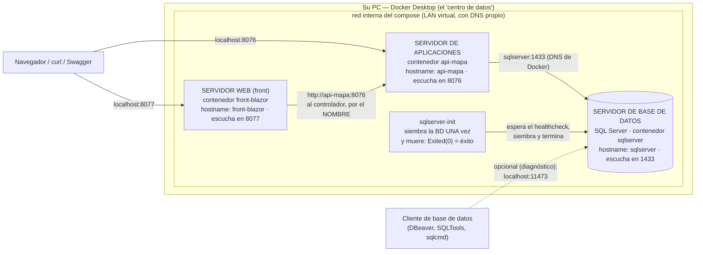
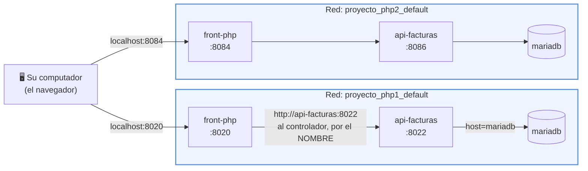

# Conceptos de Docker — imagen, contenedor, volumen, compose y Kubernetes

> Documento conceptual del curso. En la v1 usted ya usó Docker (el
> `docker compose up -d --build` que levanta la BD y la API); aquí está el
> mapa completo de conceptos, con los ejemplos de este proyecto.

---

## 1. ¿Qué problema resuelve Docker?

"En mi máquina sí funciona." Cada estudiante tiene un PC distinto (Windows,
versiones, configuraciones) y un software como SQL Server instalado a mano
se comporta distinto en cada uno. Docker empaqueta el software **con todo
su entorno** en una unidad estándar que corre igual en cualquier máquina.
En este curso: nadie instala SQL Server ni .NET — todos corren **los mismos
contenedores**.

## 2. Imagen

Una imagen es una **plantilla inmutable y empaquetada**: un sistema de
archivos congelado (SO base + programa + librerías + configuración) más
metadatos (qué comando arrancar, qué puerto expone).

- **Inmutable**: una vez construida, no cambia. Cambiar algo = construir
  OTRA imagen.
- Se construye en **capas** (cada instrucción de un `Dockerfile` es una
  capa que se cachea — por eso las reconstrucciones son rápidas).
- Viene de un **registro** o se construye localmente. Este proyecto usa de
  ambas: `mcr.microsoft.com/mssql/server:2022-latest` viene del registro de
  Microsoft; la de la API **se construye** con el `Dockerfile` de
  `api_mapa/` (base: `dotnet/sdk:10.0`).

**Analogía:** la imagen es el **molde de la galleta**.

### 2.1 El `Dockerfile`: la receta de la imagen

Una imagen no aparece sola: **alguien escribe cómo se arma**. Ese «cómo»
va en un archivo llamado `Dockerfile` (sin extensión), y este proyecto
tiene 2: `./api_mapa`, `./front_blazor`.

Este es el de `api-mapa`, sin los comentarios para verlo de un vistazo:

```dockerfile
FROM mcr.microsoft.com/dotnet/sdk:10.0
WORKDIR /app
ENV DOTNET_USE_POLLING_FILE_WATCHER=1 ASPNETCORE_URLS=http://0.0.0.0:8076
EXPOSE 8076
CMD ["dotnet", "watch", "run", "--non-interactive", "--project", "ApiMapa.csproj"]
```

Esto hace cada instrucción:

| Instrucción | Qué hace | Por qué está aquí |
|---|---|---|
| `FROM mcr.microsoft.com/dotnet/sdk:10.0` | **De dónde se parte.** Toma una imagen ya hecha | Nadie arma un sistema desde cero: se parte de una que ya trae lo básico |
| `WORKDIR /app` | La carpeta donde se trabaja dentro del contenedor | Para no repetir la ruta completa en cada instrucción siguiente |
| `ENV DOTNET_USE_POLLING_FILE_WATCHER=1 ASPNE…` | Define **variables de entorno** que quedan en la imagen | El programa las lee al arrancar |
| `EXPOSE 8076` | **Documenta** en qué puerto escucha el programa | No abre nada: quien publica el puerto es el `ports:` del compose |
| `CMD ["dotnet", "watch", "run", "--non-inter…` | **El comando que se ejecuta al encender** el contenedor | Si ese proceso termina, el contenedor se apaga |

**La diferencia entre `RUN` y `CMD`** es la que más se confunde:

| | Cuándo corre | Cuántas veces |
|---|---|---|
| `RUN` | Al **construir** la imagen (`--build`) | Una sola vez, y queda guardado |
| `CMD` | Al **encender** el contenedor | Cada vez que arranca |


### 2.2 ¿Por qué DOS archivos y no uno?

Es la pregunta que sigue, y la respuesta es que **responden preguntas
distintas**:

| | `Dockerfile` | `docker-compose.yml` |
|---|---|---|
| **Qué responde** | ¿Cómo se **arma** esta pieza? | ¿Cómo se **combinan** las piezas? |
| **De qué habla** | De **un** programa | Del **sistema completo** |
| **Cuántos hay** | Uno por cada imagen propia | **Uno solo** por proyecto |
| **Qué contiene** | Instalar, copiar, con qué comando arranca | Servicios, puertos, variables, volúmenes, orden |
| **Se usa con** | `docker build` | `docker compose up` |

**Es decir:** el `Dockerfile` describe **cómo se construye un artefacto**
—una imagen—, y el `docker-compose.yml` describe **cómo se despliega un
sistema** compuesto por varios de esos artefactos.

Son dos responsabilidades distintas y es deliberado que estén separadas:

| Responsabilidad | Archivo | Pregunta que resuelve |
|---|---|---|
| **Empaquetado** | `Dockerfile` | ¿Qué necesita este programa para ejecutarse en cualquier parte? |
| **Orquestación** | `docker-compose.yml` | ¿Cómo se conectan y en qué orden arrancan los programas de este sistema? |

Separarlas es lo que permite que **la misma imagen se use en otro sistema
sin arrastrar la configuración de este**: los puertos, las claves y las
dependencias entre servicios no están dentro de la imagen, sino afuera, en
el archivo que describe el montaje.

### Y por eso no todos los servicios tienen `Dockerfile`

En este proyecto:

| Servicio | ¿Tiene `Dockerfile`? | Por qué |
|---|---|---|
| `api-mapa` | **Sí**, en `./api_mapa` | Es código **suyo**: nadie más lo tiene, hay que armarlo |
| `front-blazor` | **Sí**, en `./front_blazor` | Es código **suyo**: nadie más lo tiene, hay que armarlo |
| `sqlserver` | **No** | Usa `mcr.microsoft.com/mssql/server:2022-latest`, una imagen ya hecha: no hay nada que construir |
| `sqlserver-init` | **No** | Usa `mcr.microsoft.com/mssql/server:2022-latest`, una imagen ya hecha: no hay nada que construir |

**Un `Dockerfile` por imagen propia; un compose por sistema.** Si mañana
este proyecto sumara otro servicio propio, tendría su propio `Dockerfile`
y una entrada más en el mismo compose.

### Cuál se toca cuando algo cambia

| Lo que cambia | Se toca |
|---|---|
| Una librería o dependencia del programa | El `Dockerfile` (y toca `--build`) |
| La versión del lenguaje | El `Dockerfile` |
| Un puerto, una clave, una dirección | El `docker-compose.yml` |
| Agregar un servicio nuevo | El `docker-compose.yml` (y su `Dockerfile`, si es propio) |
| El orden en que arrancan | El `docker-compose.yml` |

> **Y hay una razón de fondo:** el `Dockerfile` es **portátil** — esa imagen
> sirve en este proyecto, en otro, o en un servidor de producción, sin
> cambiarle una línea. El compose, en cambio, describe **este** sistema:
> estos puertos, estas claves, esta red. Mezclarlos en un solo archivo
> amarraría la pieza reutilizable al montaje de un día.


## 3. Contenedor

Un contenedor es una **instancia viva de una imagen**: un proceso corriendo
con su propio sistema de archivos, red y espacio de procesos, aislado del
resto de su PC.

- De una imagen salen **muchos contenedores** (galletas del mismo molde).
  En este proyecto pasa de verdad: `sqlserver` y `sqlserver-init` son DOS
  contenedores de la MISMA imagen — uno es el motor, el otro solo ejecuta
  el script de la BD y termina.
- Es **efímero y desechable**: `docker compose down` los destruye sin
  drama, y `up -d` los recrea idénticos.
- **No es una máquina virtual**: comparte el kernel del host con
  aislamiento de procesos. Por eso arranca en segundos (la excepción de
  peso es SQL Server, que necesita ~2 GB de RAM por ser SQL Server, no por
  ser contenedor).

**Analogía:** el contenedor es la **galleta**.

## 4. Volumen (y el estado)

Si los contenedores son desechables… ¿dónde viven los datos? En
**almacenamiento que sobrevive al contenedor**:

| Mecanismo | Qué es | En este proyecto |
|---|---|---|
| **Volumen nombrado** | Espacio administrado por Docker, montado dentro del contenedor | `mssqldata` — los datos de SQL Server (por eso `down`/`up` los conserva) |
| **Bind mount** | Una carpeta de SU disco montada dentro del contenedor | `./api_mapa:/app` (el código entra al contenedor y `dotnet watch` lo vigila) · `./db:/scripts:ro` (los scripts del init, solo lectura) |
| **Volumen anónimo** | Un hueco sin nombre que "tapa" una subcarpeta del bind mount | `/app/bin` y `/app/obj` — los compilados de Linux quedan DENTRO del contenedor, sin mezclarse con los de Windows |

**La regla de oro que ata los tres conceptos:** *la imagen es inmutable, el
contenedor es desechable, y el volumen es lo único que debe importarte
perder.*

```
Dockerfile   →  IMAGEN      →  CONTENEDOR   →  VOLUMEN
(receta)        (molde)        (galleta)       (la memoria)
             docker build    docker run       -v / volumes
```

> **La sorpresa que confunde a todo el mundo:** el volumen sobrevive
> INCLUSO a borrar la carpeta del proyecto. Si usted borra la carpeta,
> vuelve a hacer `git clone` y ejecuta `docker compose up -d --build`,
> la BD arranca **con los datos de la última vez** — no con las semillas.
> ¿Por qué? El volumen no vive en la carpeta: vive en el área de Docker,
> identificado por el nombre del proyecto compose (= el nombre de la
> carpeta). Misma carpeta → mismo nombre → mismo volumen de siempre.
>
> | Comando | ¿Y los datos? |
> |---|---|
> | `docker compose up -d --build` | Se conservan |
> | `docker compose down` | Se conservan |
> | borrar la carpeta y re-clonar | **Se conservan** (el volumen no estaba ahí) |
> | `docker compose down -v` | **SE BORRAN** — el único que resetea |
>
> Para una demo con las semillas exactas:
> `docker compose down -v` y luego `docker compose up -d --build`.

### El despliegue de ESTE proyecto, dibujado (Mermaid)

Todo lo anterior, junto: lo que `docker compose up -d` levanta aquí es un
**sistema de servidores en miniatura** — cada contenedor es un servidor
con su propio hostname, unidos por la red interna del compose:



**Guía de lectura:** los servicios se hablan entre sí **por nombre**
(el DNS interno de Docker resuelve `postgres`, `api-registros`, etc. a la
IP del contenedor — jamás `localhost`, que dentro de un contenedor es él
mismo). Hacia su PC solo existen las puertas `localhost:PUERTO` que el
compose publica. Por eso este mismo diseño se despliega igual en un
servidor real: cambiar de máquina no cambia la arquitectura.

## 5. Docker Compose (el "un solo comando" del proyecto)

**Compose** es la respuesta **declarativa** a "¿cómo levanto varios
contenedores en orden, con sus puertos, volúmenes y dependencias?": un
archivo `docker-compose.yml` declara el estado deseado del sistema y
`docker compose up -d` lo materializa. Es **declarativo, no imperativo**:
usted no escribe los pasos, escribe el resultado (el mismo espíritu de SDD).

### El `docker-compose.yml` de ESTE proyecto, por piezas

**El motor (imagen del registro + volumen + healthcheck):**

```yaml
  sqlserver:
    image: mcr.microsoft.com/mssql/server:2022-latest
    environment:
      ACCEPT_EULA: "Y"
      MSSQL_SA_PASSWORD: "Paradigmas123!"
    volumes:
      - mssqldata:/var/opt/mssql     # volumen nombrado: los datos sobreviven
    ports:
      - "11473:1433"                 # "puerto en su PC : puerto interno"
    healthcheck:                     # ¿la BD ya RESPONDE consultas?
      test: ["CMD-SHELL", "…sqlcmd… -Q 'SELECT 1'…"]
```

**El inicializador (la particularidad de SQL Server):**

```yaml
  sqlserver-init:
    image: mcr.microsoft.com/mssql/server:2022-latest   # la MISMA imagen
    depends_on:
      sqlserver:
        condition: service_healthy   # espera a que el motor RESPONDA
    volumes:
      - ./db:/scripts:ro             # init.sh + mapa_local.sql, solo lectura
    entrypoint: ["/bin/bash", "/scripts/init.sh"]
    restart: "no"                    # corre UNA vez y termina
```

SQL Server no ejecuta automáticamente scripts montados (a diferencia de
otros motores): este contenedor se conecta, crea la BD si no existe, corre
el script y muere — un patrón de Docker que vale la pena conocer.

**La API (imagen construida + código montado + hot-reload):**

```yaml
  api-registros:
    build: ./api_mapa            # se construye con SU Dockerfile
    volumes:
      - ./api_mapa:/app          # guardar un .cs → dotnet watch recompila
      - /app/bin                     # volúmenes anónimos: compilados de Linux
      - /app/obj                     #   sin mezclarse con los de Windows
    ports:
      - "8076:8076"
    environment:
      # El host es el NOMBRE del servicio (sqlserver), no localhost:
      ConnectionStrings__SqlServer: "Server=sqlserver,1433;…"
    depends_on:
      sqlserver-init:
        condition: service_completed_successfully
        # ↑ arranca cuando el init TERMINÓ BIEN: la BD ya existe
```

Las tres ideas que este archivo demuestra:

1. **Dos redes de nombres**: hacia su PC, puertos publicados
   (`localhost:8076`, `localhost,11473`); entre contenedores, nombres de
   servicio (`sqlserver,1433`). El mismo motor tiene dos "direcciones"
   según quién lo llame.
2. **Dependencias con condiciones**: `service_healthy` (el motor responde)
   y `service_completed_successfully` (el init terminó bien) — la API no
   arranca "por azar" sino cuando sus prerequisitos están listos.
3. **Desarrollo dentro del contenedor**: código montado + `dotnet watch` =
   guardar recompila, sin reconstruir la imagen. Solo se reconstruye
   (`--build`) cuando cambian el `.csproj` o el Dockerfile.

### Contenedores huérfanos y `--remove-orphans`

Compose recuerda qué contenedores creó para este proyecto (los marca con el
nombre de la carpeta). Si el `docker-compose.yml` **deja de declarar** un
servicio que antes existía, su contenedor queda **huérfano** y Compose lo
avisa al arrancar. No estorba (está detenido), pero ocupa disco. La
limpieza:

```powershell
docker compose up -d --remove-orphans   # levanta lo declarado Y borra los huérfanos
```

Importante: borra los **contenedores** sobrantes, no los **volúmenes** —
los datos de la BD siguen ahí (sección 4).

### Las directivas del `docker-compose.yml`, una por una

Estas son las palabras clave que usa el archivo de arriba, con lo que
significan y qué pasaría si faltaran:

| Directiva | Qué declara | Si no está |
|---|---|---|
| `services:` | La lista de contenedores del sistema. Cada nombre debajo es un servicio | No hay nada que levantar |
| `image:` | **Usa** una imagen ya hecha, del registro público | Habría que construirla con `build:` |
| `build:` | **Construye** la imagen con el `Dockerfile` de esa carpeta | Docker no sabría cómo armar su aplicación |
| `environment:` | Variables que el programa lee al arrancar (claves, direcciones) | El programa arranca sin saber a qué base conectarse |
| `volumes:` | Qué carpetas o volúmenes se montan dentro del contenedor | Los datos se pierden al apagar, y el código no se refresca |
| `ports:` | `"puerto en su PC : puerto dentro del contenedor"` | El servicio corre pero **usted no lo puede abrir** desde el navegador |
| `depends_on:` | En qué orden arrancan los servicios | Arrancan a la vez, y la API busca una base que todavía no existe |
| `healthcheck:` | Cómo saber si el servicio **ya responde**, no solo si «existe» | `depends_on` esperaría a que arranque, no a que sirva |
| `restart:` | Qué hacer si el proceso se muere | El contenedor se queda caído |
| `container_name:` | Le fija el nombre al contenedor | Docker le pone uno derivado del servicio |
| `volumes:` (al final, sin indentar) | Declara los volúmenes **nombrados** que usan los servicios | El volumen no existe y el servicio no arranca |

**El nombre del servicio es también su dirección.** Cuando un servicio le
habla a otro, lo llama por el nombre que tiene en este archivo: Docker crea
una red interna y lo resuelve. Por eso no se usa `localhost` — **dentro de
un contenedor, `localhost` es el contenedor mismo**.

**Los dos números de `ports:` no son lo mismo.** El de la izquierda es el
puerto de su computador; el de la derecha, el de adentro. Cambiar el de la
izquierda no toca una línea de código.


### `docker compose up -d --build`: un comando que hace siete cosas

Esta es la parte que hace que valga la pena. **Un solo comando ejecuta toda
esta secuencia**, en este orden:

| # | Qué hace | El comando que se ahorra |
|---|---|---|
| 1 | **Lee** el `docker-compose.yml` y entiende el sistema completo | — |
| 2 | **Descarga** las imágenes que usted no tiene todavía (las de `image:`) | `docker pull imagen` por cada una |
| 3 | **Construye** las imágenes propias siguiendo su `Dockerfile` (las de `build:`) | `docker build -t nombre ./carpeta` por cada una |
| 4 | **Crea la red** interna para que los contenedores se encuentren por su nombre | `docker network create red` |
| 5 | **Crea los volúmenes** nombrados donde viven los datos | `docker volume create nombre` |
| 6 | **Crea y enciende un contenedor por servicio**, con sus puertos, variables y volúmenes | `docker run -d --name … -p … -e … -v … imagen` por cada uno |
| 7 | **Respeta el orden**: espera a que la base RESPONDA antes de encender la API | No tiene equivalente: habría que mirarlo a ojo |

Y todo eso **es repetible**: quien lo corra mañana en otro computador obtiene
exactamente lo mismo, porque la secuencia no está en la cabeza de nadie sino
escrita en dos archivos — el `docker-compose.yml` y los `Dockerfile`.

---

### Lo mismo, pero escrito a mano

**Sin compose**, para levantar este proyecto —que tiene **4 servicios**— hay
que escribir esto, en este orden, cada vez:

```powershell
# 1. Crear la red, para que los contenedores se encuentren por su nombre
docker network create proyecto_mapa_conocimiento1_default

# 2. sqlserver
docker run -d --name mapa-sqlserver --network proyecto_mapa_conocimiento1_default --restart unless-stopped `
  -e "ACCEPT_EULA=Y" `
  -e "MSSQL_SA_PASSWORD=Aplicacionweb123!" `
  -v mssqldata:/var/opt/mssql `
  -p 11473:1433 mcr.microsoft.com/mssql/server:2022-latest

# 3. ESPERAR a que responda de verdad… mirándolo a ojo

# 4. sqlserver-init
docker run -d --name mapa-sqlserver-init --network proyecto_mapa_conocimiento1_default --restart no --entrypoint /bin/bash `
  -e "MSSQL_SA_PASSWORD=Aplicacionweb123!" `
  -v "${PWD}/db:/scripts:ro" mcr.microsoft.com/mssql/server:2022-latest /scripts/init.sh

# 5. Construir la imagen de api-mapa y encenderla
docker build -t api-mapa ./api_mapa
docker run -d --name mapa-api --network proyecto_mapa_conocimiento1_default --restart unless-stopped `
  -e "ConnectionStrings__SqlServer=Server=sqlserver,1433;Database=mapa_local;User Id=sa;Password=Aplicacionweb123!;TrustServerCertificate=True;" `
  -v "${PWD}/api_mapa:/app" `
  -v /app/bin `
  -v /app/obj `
  -p 8076:8076 api-mapa

# 6. Construir la imagen de front-blazor y encenderla
docker build -t front-blazor ./front_blazor
docker run -d --name mapa-front --network proyecto_mapa_conocimiento1_default --restart unless-stopped `
  -e "UrlApi=http://api-mapa:8076" `
  -v "${PWD}/front_blazor:/app" `
  -v /app/bin `
  -v /app/obj `
  -p 8077:8077 front-blazor

```

**7 comandos**, con sus flags, en un orden que no se puede equivocar.
Con compose, todo eso es:

```powershell
docker compose up -d --build
```

**De dónde sale cada pedazo:**

| Lo que antes era un flag | Ahora vive en |
|---|---|
| `docker build -t … ./carpeta` | `build:` del compose, y el **`Dockerfile`** de esa carpeta dice cómo |
| `-p 8080:8080` | `ports:` |
| `-e VARIABLE=valor` | `environment:` |
| `-v origen:destino` | `volumes:` |
| `--network …` | Compose la crea sola y mete a todos adentro |
| `--name` | El nombre del servicio |
| El orden y la espera | `depends_on:` + `healthcheck:` |

Y las dos banderas del comando:

| Bandera | Qué hace | Cuándo se usa |
|---|---|---|
| `-d` | Lo deja corriendo **en segundo plano** y le devuelve la terminal | Casi siempre. Sin ella la terminal queda pegada |
| `--build` | **Reconstruye** las imágenes propias antes de encender | La primera vez, y cada vez que cambie un `Dockerfile` |

> **Por eso el curso dice «un solo comando».** No es comodidad: es que el
> sistema entero queda **escrito** en dos archivos en vez de vivir en la
> memoria de quien lo levantó la primera vez. Cualquiera lo reproduce igual,
> y eso es lo que hace que su proyecto sea entregable.


### ¿Por qué esa dirección del `.yml` no abre en el navegador?

Es el tropiezo más común, y vale la pena entenderlo porque explica cómo
se hablan los contenedores.

En el compose aparece una dirección como esta:

```yaml
URL_API: http://api-mapa:8076
```

Si usted la escribe en el navegador, **no abre**. El navegador responde que
no encuentra el sitio, y parece que algo quedó mal montado. No es así.

**`api-mapa` es un nombre que solo existe dentro de la red de Docker.**
Su navegador corre en Windows, fuera de esa red, y no sabe quién es.

| Desde dónde | Qué dirección sirve | Por qué |
|---|---|---|
| **Su navegador** | `http://localhost:8076` | Está fuera de Docker. Usa el puerto **publicado** |
| **Otro contenedor** | `http://api-mapa:8076` | Están en la misma red: se llaman por el **nombre del servicio** |

Esa línea del compose **no está puesta para usted**: es la que usa el
contenedor del front para hablarle a la API. Son vecinos en la misma red.

### La regla, en dos renglones

| Quién pregunta | Qué escribe |
|---|---|
| Usted, en el navegador | `localhost` + el puerto de la **izquierda** de `ports:` |
| Un contenedor a otro | el **nombre del servicio** + el puerto de la **derecha** |

> **En este proyecto los dos números son iguales** (`8076:8076`), y eso
> despista: parece que la dirección debería funcionar igual desde
> cualquier parte. Lo que cambia no es el puerto — es **el nombre de la
> máquina a la que se le pregunta**.

### Y al revés también rompe

Si alguien cambiara esa línea por `http://localhost:8076`, el front
dejaría de encontrar la API. Porque **dentro de un contenedor, `localhost` es
el contenedor mismo** — y ahí no hay ninguna API, solo el front.

Ese es el error que más cuesta encontrar, porque `localhost` se ve correcto
y en su computador sí funciona.


### Subir, bajar, y qué ocupa cada proyecto encendido

Antes del problema, el manejo diario. **Todo se hace parado en la carpeta del
proyecto**, la que tiene el `docker-compose.yml`.

| Qué quiere | Comando | Qué pasa |
|---|---|---|
| **Subir** | `docker compose up -d` | Crea la red, los volúmenes y los contenedores, y los deja corriendo |
| **Bajar** | `docker compose down` | Apaga y **borra los contenedores y la red**. Los **datos se conservan** |
| **Bajar y borrar los datos** | `docker compose down -v` | Lo anterior **y borra el volumen**: la base vuelve a cargarse desde cero |
| **Pausar sin desarmar** | `docker compose stop` | Apaga los contenedores pero **la red sigue ocupada** |
| **Ver qué hay de este proyecto** | `docker compose ps -a` | Los servicios de esta carpeta |
| **Ver TODO lo encendido** | `docker ps` | De todos los proyectos del computador |

> **`stop` y `down` no son lo mismo, y aquí importa la diferencia.** `stop`
> apaga el motor pero **deja la red reservada**; `down` la libera. Si lo que
> necesita es espacio para otro proyecto, `down`.

**Qué ocupa un proyecto encendido:**

| Recurso | ¿Se libera con `down`? |
|---|---|
| Memoria y CPU | Sí |
| Los **puertos** publicados | Sí |
| **La red** | Sí |
| El **volumen** con los datos | **No** — y está bien: por eso no se pierde nada |
| Las imágenes descargadas | No |

---

### Qué es una «red de Docker», antes de seguir

Cuando usted levanta un proyecto, Docker le crea **una red privada solo para
él**: un cable virtual que conecta sus contenedores entre sí **y con nadie
más**.

Eso es lo que hace posibles dos cosas que usted ya usa sin pensarlas:

| Lo que usted escribe | Por qué funciona |
|---|---|
| `host=mariadb` en la API | Docker reparte nombres **dentro de esa red**: `mariadb` es el nombre del servicio, y ahí adentro se resuelve como si fuera una dirección |
| Que un proyecto **no encuentre por nombre** nada de otro | Son redes distintas, y el nombre solo vale dentro de la suya |

#### ¿Por qué se le puede llamar «red»?

Porque tiene las mismas piezas que la red de una oficina. No es una metáfora:
son los mismos componentes, hechos por software. Véalos:

```powershell
docker network inspect proyecto_mapa_conocimiento1_default
```

`inspect` muestra la ficha completa de la red. Esto es lo que trae, y por qué
cada cosa es exactamente lo que hace que merezca el nombre:

| Pieza de una red de verdad | Lo que tiene la red de Docker |
|---|---|
| Un **rango de direcciones** (la subred) | `192.168.176.0/20`: el bloque que Docker le asignó a ESE proyecto |
| Una **puerta de salida** (el *gateway*, el router) | `192.168.176.1`: por ahí sale hacia afuera lo que tenga que salir |
| Una **tarjeta de red** por máquina, con su **IP** y su **MAC** | Cada contenedor tiene las suyas: `mariadb` quedó en `192.168.176.2`, la API en `.4`, el front en `.5`, cada uno con su MAC |
| Un **servidor DNS** que traduce nombres a direcciones | Docker pone uno en `127.0.0.11`, y es el que hace que `host=mariadb` funcione |
| **Aislamiento**: quien no está en la red, no está | Los nombres de esta red no existen en ninguna otra |

Esas cinco cosas son lo que define una red. Por eso `mariadb` funciona como
dirección: **no es un truco de Docker Compose, es un DNS resolviendo un nombre
en una LAN**, igual que `www.usb.edu.co` en la de la universidad.

#### ¿Cómo se llama la red de un proyecto?

**Compose la bautiza solo**: toma el nombre de la carpeta que contiene el
`docker-compose.yml` y le pega `_default`. La carpeta `proyecto_mapa_conocimiento1` produce
la red `proyecto_mapa_conocimiento1_default`. Tres formas de confirmarlo:

```powershell
# 1. Todas las redes del computador, una línea por cada una.
docker network ls

# 2. Parado en la carpeta del proyecto: qué nombre de proyecto dedujo Compose.
#    Lo que salga en «name:» es el prefijo de su red.
docker compose config --format json

# 3. Preguntarle al contenedor en cuál red está metido. Lo de las llaves es una
#    plantilla de Go: recorre las redes del contenedor e imprime su nombre.
docker inspect mapa-front --format '{{range $k,$v := .NetworkSettings.Networks}}{{$k}}{{end}}'
```

#### Bajar una red y subir la de otro proyecto

**La forma correcta es por el proyecto, no por la red.** Una red con
contenedores dentro no se puede borrar, y Docker se lo dice:

```
Error response from daemon: error while removing network:
network proyecto_mapa_conocimiento1_default has active endpoints (name:"mapa-front" …)
```

Ese error no rompe nada: la red sigue viva y los contenedores también. Lo que
le está diciendo es que primero hay que sacar a los inquilinos. Y eso lo hace
`down`, parado en la carpeta del proyecto que quiere apagar:

```powershell
# Bajar ESTE proyecto: apaga y borra sus contenedores y SU red. Los datos
# quedan en el volumen, así que no se pierde nada.
docker compose down

# Subir el OTRO: cambiarse a su carpeta y levantarlo. Ahí Compose le crea a
# ÉL su propia red, con el nombre de ESA carpeta.
cd ..\proyecto_php2
docker compose up -d
```

Y si quedaron redes de proyectos que ya no existen —carpetas borradas,
proyectos viejos— hay una escoba:

```powershell
# Borra TODAS las redes que no tengan ningún contenedor dentro. Las que están
# en uso ni las toca, así que es seguro. Pide confirmación; -f se la salta.
docker network prune
```

> **Por qué `down` y no `stop`.** `stop` apaga los contenedores pero deja la
> red creada y el bloque de direcciones reservado. Si lo que busca es sitio
> para levantar otro proyecto, `stop` no le sirve: tiene que ser `down`.

**Y ahí está el detalle que importa:** esos bloques de direcciones no son
infinitos.

**Dos proyectos levantados al tiempo, dibujados:**



**Guía de lectura.** El navegador está **afuera** de las dos redes: entra por
`localhost` y el **puerto publicado**. Los contenedores, en cambio, se hablan
**por el nombre del servicio**, y ese nombre **solo existe dentro de su propia
red**: no hay una sola línea entre las dos cajas azules, y no es un olvido del
dibujo. Parado en `proyecto_php1`, el nombre `mariadb` es la base **de php1**;
la de php2 no tiene ahí ningún nombre que valga, aunque se llame igual y aunque
esté en el mismo computador.

> **Dos precisiones, porque la frase fácil se pasa de larga.**
>
> **Dentro de un mismo proyecto, el front SÍ alcanza la base.** Todos los
> contenedores del compose comparten la red, así que desde el front el nombre
> `mariadb` resuelve y el puerto 3306 abre. Que el front no lo haga **no es
> cosa de Docker**: Docker no lo impide. Lo impide la arquitectura por capas, y
> se sostiene a pulso — y ayuda no darle al front ni las credenciales ni el
> driver de la base, que es justo lo que hace el `docker-compose.yml` de este
> repositorio.
>
> **Entre proyectos, lo que bloquea es el NOMBRE, no un muro.** El puerto
> publicado es una puerta abierta a todo lo que alcance su computador, y otro
> contenedor lo alcanza: desde `front-blazor` de este proyecto,
> `http://host.docker.internal:PUERTO` llega a la API de otro proyecto y
> responde, y el puerto que ese otro publique para su base abre igual. Lo que
> aísla es el **DNS interno**; las puertas publicadas siguen siendo puertas.
> (En Docker Desktop `host.docker.internal` existe solo; en un servidor Linux
> hay que declararlo con `extra_hosts`.)

Si quiere verlo en su máquina, con este proyecto levantado:

```bash
# ¿«front-blazor» alcanza la base de SU propio proyecto? Le pregunta por el nombre
# al DNS interno de Docker. Si responde una IP, la red NO lo está impidiendo:
# lo único que lo impide es la disciplina de no hacerlo.
docker compose exec front-blazor getent hosts sqlserver

# ¿Y algo de OTRO proyecto, por su puerta publicada? Cambie PUERTO por uno que
# el otro compose publique. -s calla la barra de progreso, -o /dev/null tira el
# cuerpo y -w "%{http_code}" imprime solo el código: si sale un número, del
# otro lado contestaron.
docker compose exec front-blazor curl -s -o /dev/null -w "%{http_code}\n" \
    http://host.docker.internal:PUERTO/
```

> **Fíjese en la flecha que NO está.** Del front no sale ninguna línea hacia una
> base de datos: ni hacia la del otro proyecto, ni hacia la suya. El front habla
> con los **controladores** de la API, y ahí se acaba su mundo; quien toca la
> base es la API. Y eso **no** es cosa de redes: aunque estuvieran los seis
> contenedores en la misma red, el front seguiría sin tener nada que ir a buscar
> a la base. Es la arquitectura por capas. La red explica por qué no *puede*;
> las capas explican por qué no *debe*.

Y fíjese en lo que eso implica: **cada caja azul necesita su propio bloque de
direcciones.** De ahí sale el problema que viene.


### Cuando Docker dice que ya no caben más redes

Levantando varios proyectos, un día aparece esto:

```
Error response from daemon: all predefined address pools have been fully subnetted
failed to create network proyecto_php1_default
```

Y **no es culpa del proyecto que intentó levantar**: el que falla es el
siguiente de la fila, no el culpable.

> ### Esto pasó de verdad, y por eso se deja escrito
>
> **12 de septiembre de 2026.** Con los proyectos del curso levantados, un
> `docker compose up -d` en otro proyecto respondió:
>
> ```
> all predefined address pools have been fully subnetted
> failed to create network proyecto_php1_default
> ```
>
> La primera reacción fue pensar que **ese** proyecto se había roto: se abrió
> el navegador, `localhost` rechazó la conexión, y todo apuntaba a que el
> proyecto estaba mal. No era eso. `docker network ls` mostró **31 redes**, y
> el proyecto que falló solo era el que llegó de último.
>
> Un `docker network prune -f` liberó dos redes —de proyectos ya apagados— y
> el mismo comando que había fallado funcionó de inmediato.
>
> **La lección:** cuando un proyecto que antes servía deja de levantar, mire
> primero **cuánto hay encendido**. El error rara vez está donde parece.


**Qué pasó.** Cada proyecto crea **su propia red privada** (sección 5). Docker
saca esas redes de unos rangos de direcciones que trae de fábrica, y esos
rangos **alcanzan para unas 30 redes**. La treinta y uno no cabe.

**Cómo se confirma en diez segundos:**

```powershell
docker network ls
```

Si la lista pasa de unas treinta, ese es el problema. No es memoria, no es
disco, no es el proyecto.

### ¿Hay que bajar algo? ¿Comprar más? **Ninguna de las dos**

No es un límite de licencia ni de plan de pago —Docker Desktop es gratuito
para uso educativo— y tampoco falta máquina. **Faltan direcciones de red.**
Se arregla configurando, y hay dos caminos.

#### Camino 1 — liberar redes (lo normal)

Casi siempre uno tiene encendidos proyectos de la semana pasada sin darse
cuenta.

**Paso 1.** Vea cuántas redes hay y de quién son:

```powershell
docker network ls
```

**Paso 2.** Baje los proyectos que ya no está usando. En la carpeta de cada
uno:

```powershell
docker compose down
```

**Paso 3.** Barra las redes que quedaron sin nadie adentro:

```powershell
docker network prune -f
```

**`docker network prune` es seguro:** solo borra redes **sin contenedores
conectados**. No toca datos, ni imágenes, ni nada que esté encendido. Si una
red está en uso, la deja quieta.

> **Si no sabe en qué carpeta está un proyecto viejo**, sirve igual apagar
> sus contenedores por nombre y después barrer:
>
> ```powershell
> docker ps --filter "name=proyecto_" -q | ForEach-Object { docker stop $_ }
> docker network prune -f
> ```

#### Camino 2 — ampliar el rango (cuando de verdad necesita muchos a la vez)

**El caso del profesor de este curso es exactamente ese, y la cuenta explica
por qué.**

El profesor dicta **varios cursos**. Cada curso no tiene *un* repositorio:
tiene **uno por versión**, porque cada versión es un sistema distinto que se
levanta solo. Y cada módulo del proyecto de aula existe además **en tres
lenguajes**. Multiplicando:

| Familia | Proyectos |
|---|---|
| Construcción de Software | 8 |
| Diseño de Software | 8 |
| Paradigmas | 8 |
| Aplicación y Servicios Web | 5 |
| PHP | 4 |
| Evaluaciones del ITM | 3 |
| Cátedras | 2 |
| Módulos del proyecto de aula y variantes | 26 |
| **Total de sistemas levantables** | **64** |

**Sesenta y cuatro proyectos independientes, cada uno con su propia red.**
Contra un techo de unas **30**.

Por eso el error no aparece por hacer algo mal: aparece porque **la suma da
más de lo que cabe**. Y no es un caso raro de profesor — a un estudiante le
pasa igual apenas acumula las cuatro versiones de su curso más las de otro.

**Qué hacer, según el caso:**

| Si usted… | Haga esto |
|---|---|
| Trabaja con dos o tres proyectos a la vez | **Camino 1**: baje el anterior antes de subir el siguiente. Le sobra espacio |
| Necesita muchos encendidos al tiempo | **Camino 2**: amplíe el rango una vez, y olvídese |

Ahí sí se amplía el rango. En Docker Desktop: **Settings → Docker Engine**, y
al JSON que ya está se le agrega:

```json
{
  "default-address-pools": [
    { "base": "172.17.0.0/12", "size": 20 },
    { "base": "10.100.0.0/16", "size": 24 }
  ]
}
```

**Qué le está diciendo a Docker:** «tome estos dos bloques grandes de
direcciones y párta­los en redes pequeñas». Con `size: 20` sobre un `/12`
salen **256** redes en vez de dieciséis; el segundo bloque agrega otras 256.

| | Redes que caben |
|---|---|
| De fábrica | ~30 |
| Con esa configuración | ~500 |

> ⚠️ **Al guardar, Docker se reinicia y todos los contenedores se apagan.**
> No se pierde nada —los datos están en los volúmenes— pero hay que volver a
> levantar lo que estuviera corriendo. Hágalo cuando no esté en mitad de algo.

### ¿Y qué cuesta tener tantos? ¿Dinero, memoria, procesador?

**Dinero, no.** Docker Desktop es **gratuito** para uso personal, educativo,
proyectos de código abierto y empresas de menos de 250 empleados con menos de
10 millones de dólares de ingresos anuales. Se paga solo en organizaciones
grandes y entidades gubernamentales. Un curso está cubierto, y **no se cobra
por contenedor ni por red**.

Lo que sí cuesta es **memoria y disco**. Estas son medidas reales de la
máquina del profesor, con los proyectos del curso encima:

| Recurso | Lo que había | Lo que usaba Docker |
|---|---|---|
| **RAM** | 32 GB | **14 GB** en 77 contenedores encendidos — quedaban 4 GB libres |
| **Disco** | 952 GB | **141 GB**: 71 de imágenes, 16 de volúmenes y **53 de caché de compilación** |
| **CPU** | 16 núcleos | Casi nada. Un contenedor **ocioso no consume procesador** |

**La lectura:** el procesador no es el problema; la memoria y el disco sí.

| Lo que ocupa… | Un proyecto **encendido** | Un proyecto **apagado con `down`** |
|---|---|---|
| RAM | Sí | **No** |
| Puertos y red | Sí | **No** |
| Disco (imágenes y volúmenes) | Sí | **Sí, igual** |

Por eso apagar resuelve la memoria y las redes, pero **no el disco**: las
imágenes y los volúmenes siguen ahí, y es lo correcto — por eso no se pierden
los datos.

### Cómo recuperar disco, sin perder trabajo

```powershell
docker system df
```

Muestra cuánto ocupa cada cosa y, en la columna **RECLAIMABLE**, cuánto se
puede liberar. En la máquina del ejemplo eran **33 GB**.

| Comando | Qué borra | ¿Peligroso? |
|---|---|---|
| `docker builder prune -f` | La **caché de compilación** | **No.** Solo hace que el próximo `--build` tarde un poco más |
| `docker image prune -f` | Imágenes **sin usar** por ningún contenedor | No |
| `docker volume prune -f` | Volúmenes **huérfanos**: sin contenedor que los use | **Cuidado.** Si bajó un proyecto con `down` y quería conservar su base, ese volumen está huérfano y **se borraría** |
| `docker system prune -a` | Todo lo anterior **y todas las imágenes no usadas** | Libera mucho, y el siguiente arranque **vuelve a descargar todo** |

> **El más rentable y el más inofensivo es el primero.** La caché de
> compilación suele ser lo más grande y no contiene nada suyo: se vuelve a
> generar sola.

### ¿Qué máquina hace falta para tenerlos todos encendidos?

**Ninguna, y esa es la respuesta honesta.**

Los 64 proyectos serían unos 250 contenedores. A lo que consumen los del
ejemplo, pasarían de **45 GB solo en contenedores** —y los de SQL Server
pesan más que el promedio—. Habría que irse a 64 o 128 GB de memoria para
algo **que nadie necesita**.

**Nadie trabaja con sesenta y cuatro sistemas a la vez.** Se trabaja con dos
o tres: el que está construyendo y el que usa de referencia. Lo demás se
apaga.

> La pregunta «¿qué máquina necesito para tener todo arriba?» casi siempre
> es la pregunta equivocada. La buena es **«¿qué necesito tener arriba
> ahora?»** — y la respuesta rara vez pasa de tres.


### La regla de higiene que evita todo esto

**Baje el proyecto anterior antes de levantar el siguiente.** Es la misma
disciplina que evita el choque de puertos, y no cuesta nada:

```powershell
docker compose down     # en el que ya no usa
docker compose up -d    # en el que va a usar
```

Un proyecto apagado con `down` **no ocupa red, ni puertos, ni memoria**, y sus
datos siguen intactos. Volver a encenderlo es un comando.


## 6. Kubernetes (y por qué este curso NO lo necesita)

Kubernetes (K8s) es el orquestador de contenedores **a escala de clúster**:
reparte contenedores entre muchas máquinas, escala réplicas según demanda,
reprograma lo que se cae. Compose y K8s no compiten: Compose orquesta **en
una máquina**; K8s orquesta **un clúster**.

| Kubernetes resuelve… | ¿Existe ese problema aquí? |
|---|---|
| Repartir contenedores entre muchas máquinas | No — todo corre en su PC |
| Escalar a N réplicas cuando sube el tráfico | No — el "tráfico" es usted con curl |
| Alta disponibilidad (un nodo muere → reprogramar) | No — si su PC se apaga, se acabó la clase |
| Despliegue continuo sin caída | No — "actualizar" es guardar y que recompile |
| Secretos, RBAC, múltiples equipos | No — credenciales didácticas, un usuario |

**La regla profesional:** Compose para desarrollo local y sistemas de un
host; Kubernetes cuando se necesita más de una máquina. **El puente
conceptual:** ambos son YAML declarativo describiendo estado deseado —
quien domina un compose ya entiende la mitad conceptual de K8s.

## 7. Los comandos que este curso usa (el "pastel" — en inglés: cheat sheet)

```powershell
docker ps                        # qué está corriendo (con -a: también lo detenido)
docker stop X / docker start X   # apagar / encender (los datos se conservan)
docker logs X                    # ver la salida del contenedor (errores incluidos)
docker exec X comando            # ejecutar algo DENTRO del contenedor
# … y los de todos los días en este proyecto:
docker compose up -d --build     # materializar el docker-compose.yml (con rebuild)
docker compose ps -a             # estado de los servicios (el init debe estar Exited 0)
docker compose logs api-registros # la salida de un servicio (errores incluidos)
docker compose down [-v]         # apagar todo (-v: borrar también los volúmenes = reset BD)
docker compose up -d --remove-orphans  # además, borrar contenedores huérfanos (sección 5)
```

### Cómo se leen los comandos que encuentre por ahí

Fíjese en la `X` de arriba: **no es parte del comando**. Está puesta donde va
un valor suyo — el nombre de su contenedor. Y el `[-v]` va entre corchetes
cuadrados porque es **opcional**.

Esa forma de escribir no es de este documento: es la de toda la
documentación técnica. En la página de Docker, en la de Git y en cualquier
respuesta de internet va a encontrar comandos así:

```
docker stop <nombre>
docker logs <contenedor>
git clone <url>
```

**Los signos `<` y `>` NO se escriben.** Son una marca que quiere decir
*«aquí va un valor suyo»*, y lo de adentro dice qué clase de valor.

**Ejemplo completo.** La documentación dice:

```
docker stop <nombre>
```

Usted primero averigua el nombre:

```powershell
docker ps
```

```
NAMES                              PORTS
proyecto_php1-api-facturas-1       0.0.0.0:8022->8022/tcp
proyecto_php1-mariadb-1            0.0.0.0:13326->3306/tcp
```

Y después escribe **el nombre tal como aparece**, sin los signos:

```powershell
docker stop proyecto_php1-api-facturas-1
```

Lo que **no** se escribe:

| Mal | Por qué |
|---|---|
| `docker stop <nombre>` | Dejó la marca en vez de reemplazarla |
| `docker stop <proyecto_php1-api-facturas-1>` | Puso el valor, pero dejó los signos |
| `docker stop "proyecto_php1-api-facturas-1"` | Las comillas sobran aquí |

**Las tres marcas que verá siempre:**

| Marca | Significa |
|---|---|
| `<algo>` | Obligatorio. Reemplácelo por su valor, sin los signos |
| `[algo]` | Opcional. Puede omitirlo entero |
| `a\|b` | Escoja uno de los dos |

**¿Y de dónde sale el valor?** Casi siempre de un comando que lista lo que
hay: para contenedores es `docker ps`, y el nombre está en la columna
`NAMES`.


## 8. ¿Hace falta una cuenta de Docker?

**No.** Las imágenes que usa este proyecto son **públicas**: se descargan sin
registrarse, sin iniciar sesión y sin pagar nada.

Al abrir Docker Desktop puede aparecer una ventana pidiendo *Sign in* o
*Create an account*. **Ciérrela, o escoja «Continue without signing in».**
Todo funciona igual.

### ¿Y si ya tiene cuenta y entra con ella?

**También funciona**, y hasta ayuda un poco: Docker Hub le da un límite de
descargas más alto a quien tiene la sesión abierta que a quien descarga de
forma anónima.

Dicho eso, **para este proyecto no hace falta**: ni para descargar las
imágenes, ni para levantarlas, ni para trabajar.

### Lo único que sí es obligatorio

**Que Docker Desktop esté encendido.** Ábralo y espere a que termine de
arrancar: el icono de la ballena, abajo a la derecha, deja de moverse.

Si Docker está apagado, cualquier comando responde algo así:

```
error during connect: ... the docker daemon is not running
```

Ese mensaje **no es un problema del proyecto**: es Docker que no está
corriendo. Enciéndalo y repita el comando.

---

## 9. Referencias

1. Docker — *Docker overview*: <https://docs.docker.com/get-started/docker-overview/>
2. Docker — imágenes y contenedores: <https://docs.docker.com/get-started/docker-concepts/the-basics/what-is-a-container/>
3. Docker — volúmenes: <https://docs.docker.com/engine/storage/volumes/>
4. Docker Compose: <https://docs.docker.com/compose/>
5. Kubernetes — *Overview*: <https://kubernetes.io/es/docs/concepts/overview/>
6. En este repositorio: el `docker-compose.yml` de la raíz (comentado) y
   el [README](../README.md).
