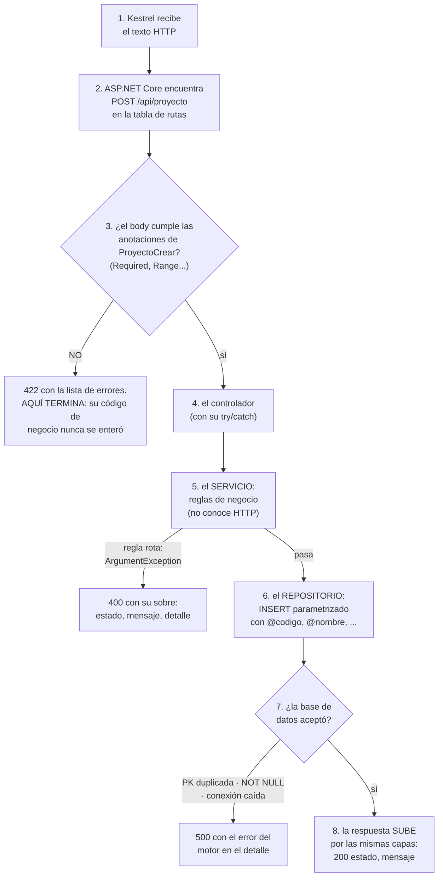
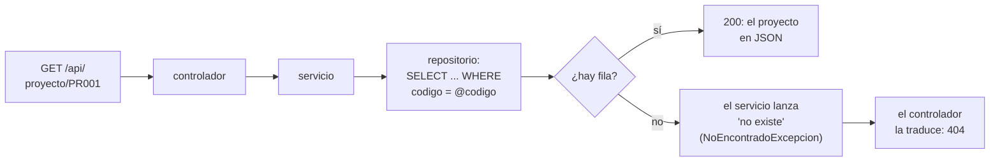

# El flujo de una petición — dónde está el GET, dónde se captura el POST

> Documento para leer CON el código abierto. Responde las preguntas que
> todo el mundo se hace la primera vez: ¿dónde "está" el GET? ¿quién
> captura el body del POST? ¿cómo termina ejecutándose mi método del
> controlador?

---

## 1. Lo primero: el verbo NO lo pone su código — lo manda el cliente

Cuando el navegador (o PowerShell, o Thunder Client) hace una petición, por
la red viaja un texto que empieza así:

```
GET /api/proyecto HTTP/1.1          ← un GET: verbo + ruta, sin body
```

```
POST /api/proyecto HTTP/1.1         ← un POST: verbo + ruta...
Content-Type: application/json

{"codigo":"PR009","nombre":"Webcam","stock":10,"valorunitario":350000}   ← ...y body
```

El verbo (GET, POST, PUT, PATCH, DELETE) **viene de afuera**. Su código no
lo declara: lo **lee** y decide qué hacer con él.

> El navegador solo sabe mandar GET desde la barra de direcciones. Para
> mandar POST/PUT/PATCH/DELETE se usa PowerShell (`Invoke-RestMethod`),
> `curl.exe` o una extensión como Thunder Client en VS Code.

## 2. ¿Dónde se captura? En ASP.NET, el framework lo hace por usted

En este proyecto no se ve un `if ($metodo === 'GET')` escrito a mano —
ASP.NET Core trae el enrutador integrado. La comparación EXISTE igual,
pero la declara usted con **atributos** y la ejecuta el framework:

| Pieza | Dónde está | Qué hace |
|---|---|---|
| `app.MapControllers();` | `Program.cs` | Enciende el enrutador: "lee los atributos de mis controladores" |
| `[Route("api/proyecto")]` | `ProyectoController.cs` | "Todas mis rutas cuelgan de /api/proyecto" |
| `[HttpGet]`, `[HttpPost]`, `[HttpPut("{codigo}")]`… | encima de cada método | **AQUÍ está el verbo**: este método atiende ESE verbo en ESA ruta |
| `[FromQuery] int limite = 1000` | parámetros del método | Captura el query string (?limite=3) ya convertido a int |
| `[FromBody] ProyectoCrear body` | parámetros del método | Captura el BODY: toma el JSON, lo vuelca en la PETICIÓN del verbo y lo VALIDA |

Cuando llega `GET /api/proyecto`, el enrutador compara el verbo y la ruta
de la petición contra los atributos de todos los controladores, encuentra
el método `Listar()` (que tiene `[HttpGet]` bajo `[Route("api/proyecto")]`)
y lo llama. **Esa comparación es "el GET"** — igual que en cualquier stack,
solo que aquí la hace el framework y usted la declara con el atributo.

## 3. El viaje completo de un POST, capa por capa

`POST /api/proyecto` con `{"codigo":"PR009","nombre":"Webcam","stock":10,"valorunitario":350000}`:

```
1. ASP.NET routing     compara verbo+ruta contra los atributos
                       → elige ProyectoController.Crear()
2. Model binding       toma el JSON del body y lo vuelca en la petición ProyectoCrear
3. Validación          revisa las anotaciones de la petición ([Required], [Range]…)
      ├─ ¿errores? → Program.cs responde 422 con la lista y AQUÍ TERMINA
      │              (el método Crear NI SE EJECUTA)
      └─ ¿limpio? → entra a Crear(body)
4. ProyectoController  construye la entidad Proyecto y llama al servicio
5. ServicioProyecto    delega al repositorio (por la interfaz)
6. RepositorioProyectoSqlServer
                       INSERT INTO proyecto (...) VALUES (@codigo, ...)  ← parametrizado
7. SQL Server          inserta la fila (y aplica SUS reglas: PK, NOT NULL…)
8. La respuesta sube:  el controller responde 200 {estado, mensaje}
```

Si algo falla en 5, 6 o 7, la excepción sube hasta el `try/catch` del
método del controller, que la traduce a un código HTTP:

| Qué pasó | Excepción | Código |
|---|---|---|
| El body venía mal formado | (no es excepción: la validación de la petición) | **422** |
| Regla de negocio rota (límite ≤ 0, PATCH sin campos) | `ArgumentException` | **400** |
| El código no existe en la tabla | `NoEncontradoExcepcion` | **404** |
| La BD rechazó (código duplicado, conexión caída…) | `SqlException` u otra | **500** |


**El mismo viaje, como diagrama de flujo** — fíjese en que la gracia son
las SALIDAS TEMPRANAS: cada capa puede terminar la película sin molestar a
las de abajo:



**Guía de lectura:** el camino feliz es la columna del centro; cada rombo
es una defensa y cada salida lateral, un código HTTP distinto. Por eso el
error también es contrato: se sabe QUIÉN lo decide (la frontera → 422, el
servicio → 400, la BD → 500) y QUIÉN le pone el número (el controlador).


## 4. El viaje de un GET (más corto: no hay body ni validación de forma)

`GET /api/proyecto/PR001`:

```
1. Routing            [HttpGet("{codigo}")] coincide → Obtener("PR001")
                      (el {codigo} de la URL llega como parámetro del método)
2. ProyectoController try { … } → llama al servicio
3. ServicioProyecto   pide al repositorio; si llega null → lanza
                      NoEncontradoExcepcion (el catch la vuelve 404)
4. Repositorio        SELECT ... WHERE codigo = @codigo
5. La fila vuelve convertida en objeto Proyecto y sale como JSON
   (el serializador convierte las propiedades públicas automáticamente)
```


**Y el del GET, en diagrama de flujo** (la defensa aquí es una sola: ¿existe?):




## 5. Véalo usted mismo (5 minutos)

En la terminal de VS Code (PowerShell), con el proyecto corriendo:

```powershell
# GET (el navegador también sirve para estos dos)
Invoke-RestMethod "http://localhost:8076/api/proyecto"
Invoke-RestMethod "http://localhost:8076/api/proyecto/PR001"

# POST — crear
Invoke-RestMethod -Method Post -Uri "http://localhost:8076/api/proyecto" -ContentType "application/json" -Body '{"codigo":"PR009","nombre":"Webcam","stock":10,"valorunitario":350000}'

# PUT con body incompleto → error 422 (PUT exige TODO)
Invoke-RestMethod -Method Put -Uri "http://localhost:8076/api/proyecto/PR009" -ContentType "application/json" -Body '{"stock":25}'

# PATCH con el MISMO body → 200 (PATCH es parcial)
Invoke-RestMethod -Method Patch -Uri "http://localhost:8076/api/proyecto/PR009" -ContentType "application/json" -Body '{"stock":25}'

# DELETE — limpiar
Invoke-RestMethod -Method Delete -Uri "http://localhost:8076/api/proyecto/PR009"
```

La pareja PUT/PATCH con el mismo body es la lección más importante del
flujo: el MISMO dato, dos verbos, dos resultados — porque cada verbo tiene
su semántica y las PETICIONES del verbo la hacen cumplir.
