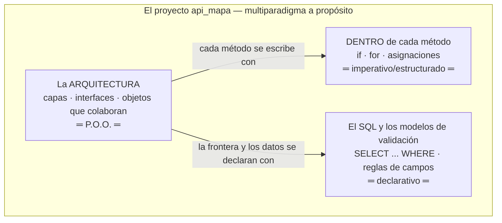
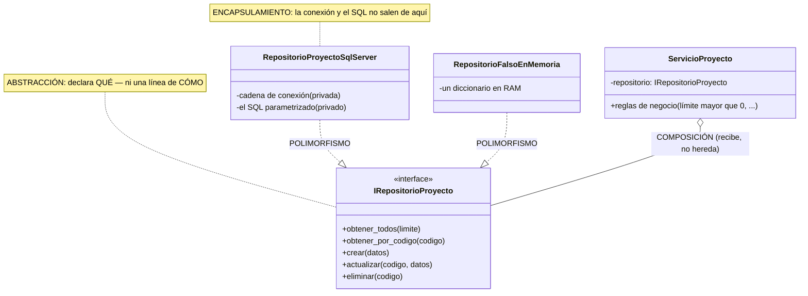
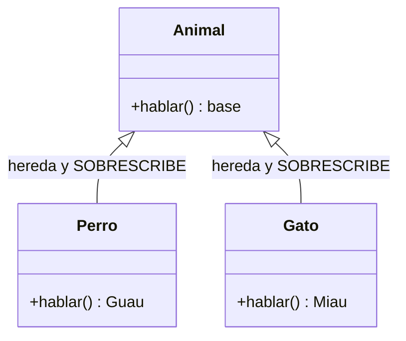
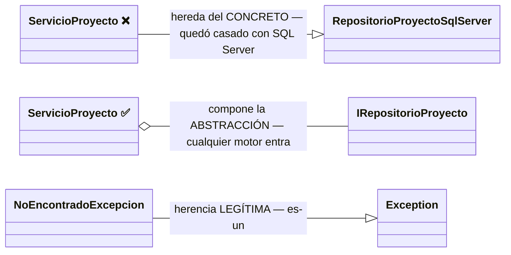
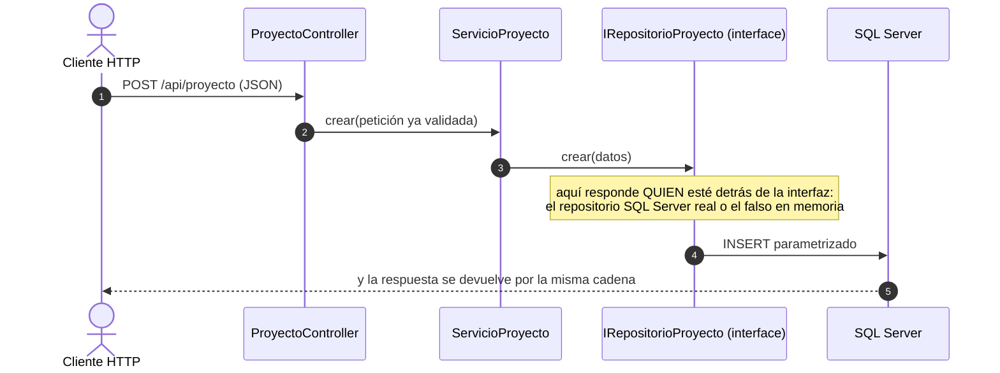

# El paradigma de Programación Orientada a Objetos (P.O.O.) — en C#

> Documento conceptual del curso: qué es un paradigma, qué propone la
> P.O.O., y dónde se ve cada idea EN el código de este proyecto.

---

## 1. ¿Qué es un paradigma de programación?

Un **paradigma** es una forma de pensar y organizar los programas: qué
piezas existen, cómo se combinan y qué se considera "buen diseño".
Ejemplos: el imperativo/estructurado (secuencia, decisión, ciclo), el
funcional (funciones puras, sin estado) y el **orientado a objetos**, que
propone organizar el programa en **objetos**: unidades que juntan DATOS
(propiedades) y COMPORTAMIENTO (métodos).

C# es un lenguaje **orientado a objetos de nacimiento**: todo el código
vive en clases, y el framework (ASP.NET Core) está construido sobre estas
ideas — por eso este curso ES un curso de P.O.O. aplicada.

### 1.1 El MISMO problema en tres paradigmas (ejemplo comparado)

Problema: saber cuánto suman los presupuestos de proyectos activos. Mírelo tres veces:

```csharp
// IMPERATIVO: el CÓMO, paso a paso (así se ve DENTRO de un método)
var total = 0d;
foreach (var f in filas)
{
    total += f.Presupuesto;
}
```

```sql
-- DECLARATIVO: el QUÉ, sin pasos — el motor decide el CÓMO
SELECT SUM(presupuesto) FROM proyecto WHERE activo = TRUE;
```

```csharp
// P.O.O.: objetos que colaboran — cada uno con SU responsabilidad
$servicio->sumarPresupuestos();   // el servicio le PIDE al repositorio;
                       // nadie de afuera ve SQL ni conexiones
```

> **Ese último método todavía no existe**, y se dice para que nadie lo
> busque: la v1 solo lista, obtiene, crea, reemplaza, actualiza y retira.
> Está escrito así para mostrar **dónde viviría** el día que se necesite —
> en el servicio, no en el controlador ni en la pantalla.

Los tres resuelven lo mismo. La diferencia es QUIÉN carga con el detalle:
en el imperativo usted; en el declarativo el motor; en la P.O.O. cada
objeto carga con SU parte — y eso es lo que permite cambiar una pieza sin
tocar las demás.

### 1.2 Dónde vive cada paradigma en ESTE proyecto (Mermaid)



**Guía de lectura:** los paradigmas no compiten — conviven por niveles. La
P.O.O. organiza el edificio; el imperativo pone los ladrillos dentro de
cada método; el declarativo describe datos y consultas. Saber CUÁL usar en
cada nivel es la competencia, no militar en uno.

## 2. Los 4 pilares, con su ejemplo en este proyecto

### Encapsulamiento
Juntar datos y comportamiento, y **controlar el acceso**. En C#, la
herramienta central son las **propiedades** — `{ get; set; }` — que SON los
getters y setters del lenguaje (C# los escribe por usted):

```csharp
public class Proyecto
{
    public required string Codigo { get; set; }   // propiedad: get/set automáticos
    public int Stock { get; set; }
}
```

Y en las capas: `RepositorioProyectoSqlServer` guarda su cadena de conexión
como `private readonly` — nadie más en el sistema sabe que existe.

### Herencia
Una clase extiende a otra y recibe lo suyo. En la v1:
`NoEncontradoExcepcion : Exception` — hereda todo lo que una excepción sabe
hacer (llevar mensaje, lanzarse, atraparse) y solo aporta su NOMBRE, que es
lo que permite el `catch` selectivo (404 vs 500).

### Polimorfismo
**El requisito central del proyecto**: piezas intercambiables tras una
interfaz. `ServicioProyecto` funciona igual con
`RepositorioProyectoSqlServer` (el real) que con `RepositorioFalsoEnMemoria`
(el de la prueba de capas) — porque ambos firman `: IRepositorioProyecto`.
Cuando la v3 agregue PostgreSQL, será OTRA clase con la misma interfaz.

### Abstracción
Quedarse con lo esencial y esconder el detalle. Las **interfaces**
(`IServicioProyecto`, `IRepositorioProyecto`) son abstracción pura: declaran
QUÉ se puede hacer sin una línea de CÓMO. El controlador depende de la
abstracción, no del detalle.

### 2.5 Los cuatro pilares, dibujados sobre la v1 (Mermaid)



**Guía de lectura:** los cuatro pilares están en UN dibujo. La interfaz es
la abstracción; los atributos privados del repositorio son el
encapsulamiento; las dos flechas punteadas que llegan a la misma interfaz
son el polimorfismo (piezas intercambiables); y el rombo del servicio es
composición: recibe el repositorio por constructor en vez de heredarlo — la herencia buena de la v1 es
`NoEncontradoExcepcion : Exception`: una excepción CON nombre propio ES
una excepción.

**Las DOS caras del polimorfismo (aclaración importante).** La
definición es una sola: **el MISMO mensaje, respuestas DIFERENTES**. Pero
se logra de dos maneras, y conviene distinguirlas:

**Cara A — la del libro: herencia + sobrescritura.** Un método existe en
la clase PADRE y la clase hija lo vuelve a programar a su manera
(sobrescribir / override):

```csharp
public class Animal
{
    public virtual string Hablar() => "...";   // el método vive en el PADRE...
}
public class Perro : Animal
{
    public override string Hablar() => "¡Guau!";  // ...y la hija lo SOBRESCRIBE
}
public class Gato : Animal
{
    public override string Hablar() => "¡Miau!";
}
// foreach (Animal a in animales) a.Hablar();  ← el MISMO mensaje, DOS respuestas
```



**Cara B — la de ESTE proyecto: contrato + implementaciones.** Aquí NO hay
clase padre con código: hay una **interfaz**, que declara el mensaje pero
no trae ninguna programación. Dos clases sin parentesco entre sí lo
responden, cada una a su modo:

```csharp
// El contrato NO tiene código: solo declara el mensaje
public interface IRepositorioProyecto
{
    Task<bool> CrearAsync(Proyecto datos);
}

// Dos clases SIN parentesco responden el MISMO mensaje, cada una a su modo:
public class RepositorioProyectoSqlServer : IRepositorioProyecto
{
    public Task<bool> CrearAsync(Proyecto datos)
        { /* ejecuta un INSERT parametrizado en SQL Server */ }
}
public class RepositorioFalsoEnMemoria : IRepositorioProyecto
{
    public Task<bool> CrearAsync(Proyecto datos)
        { _filas[datos.Codigo] = datos; /* un diccionario en RAM */ }
}
```

Cuando `ServicioProyecto` manda el mensaje `crear(datos)`, NO sabe (ni le
importa) cuál de las dos clases contesta — una escribe en SQL Server, la otra en
un diccionario. **Eso es el polimorfismo del diagrama de arriba:** las dos
flechas punteadas que llegan a la interfaz son las dos respuestas
posibles al mismo mensaje.

| | Cara A (herencia) | Cara B (contrato — la del proyecto) |
|---|---|---|
| ¿Dónde se declara el mensaje? | En la clase PADRE (con código propio) | En la INTERFAZ (sin una línea de código) |
| ¿Las clases se emparentan? | Sí: hija ES-UN padre | No: solo firman el mismo contrato |
| ¿Qué se comparte? | Código heredado + el mensaje | SOLO el mensaje |
| Riesgo | Acopla: la hija arrastra TODO lo del padre | Ninguno de acoplamiento: por eso el curso la prefiere |

Las dos son polimorfismo legítimo. El proyecto usa la cara B porque
necesita piezas intercambiables SIN compartir código (un repositorio real
y uno falso no tienen nada en común por dentro) — y porque es la que
permite cambiar de motor sin tocar el servicio.

**¿Y la herencia DE VERDAD, dónde está en este proyecto?** En las
excepciones: `NoEncontradoExcepcion : Exception` — hereda todo lo que una
excepción sabe hacer y solo aporta su NOMBRE, que es lo que permite el
catch selectivo (404 vs 500). Herencia bien usada: pequeña y con motivo.

**Herencia vs composición — el error clásico, dibujado:**



**Guía de lectura:** si el servicio HEREDA del repositorio concreto, cambiar
de motor exige tocar el servicio (y probar sin BD es imposible). Si lo
COMPONE a través de la interfaz, el motor se cambia por fuera — esa
decisión de un solo rombo es la que paga todo el proyecto.

**"Objetos que se mandan mensajes" — la v1 como conversación.**
¿Quién es **Alan Kay**? El científico que ACUÑÓ el término "orientado a
objetos": creó Smalltalk en Xerox PARC (años 70) y recibió el premio
Turing (2003). Y dijo algo sorprendente: se arrepentía de haberlo llamado
"objetos", porque *"la gran idea es el ENVÍO DE MENSAJES"* — cada objeto
es una cajita cerrada que recibe un mensaje, lo resuelve por dentro como
quiera y responde, sin que el remitente sepa CÓMO. En la práctica, cada
llamada a un método ES un mensaje. Mire la v1 con esos ojos:



**Guía de lectura:** cada flecha es un MENSAJE entre objetos — ninguno sabe
CÓMO trabaja el siguiente, solo QUÉ mensaje entiende. Esa era la idea
original de Alan Kay al acuñar "orientado a objetos": menos árboles de
herencia, más objetos conversando.

## 3. ¿Qué es un modelo? (y qué son las peticiones)

> **Un modelo es la clase ENTIDAD: representa un dato del dominio — una
> fila de una tabla — con sus campos y tipos.** En este proyecto los
> modelos viven en `Modelos/`; en la v1 hay uno: `Proyecto`.

Pero a una API también le LLEGAN datos: el body del POST, del PUT y del
PATCH. Esos body también se describen con clases — y NO son modelos,
porque no representan una entidad del dominio sino **lo que el cliente
envía en UN verbo concreto**. Esas clases son las **PETICIONES** y viven
en `Peticiones/`:

| | Modelo (`Modelos/`) | Petición (`Peticiones/`) |
|---|---|---|
| Qué describe | El dato **como ES adentro** (la fila de la tabla) | El dato **como LLEGA de afuera** (el body de un verbo) |
| En la v1 | `Proyecto` | `ProyectoCrear`, `ProyectoReemplazo`, `ProyectoActualizar` |
| Qué lleva | Los campos con sus tipos | Los campos con sus tipos **+ las reglas de entrada** (`[Required]`, `[Range]`…) |
| Cuántas hay | UNA por tabla | Una por verbo (cada verbo exige cosas distintas) |

**Analogía:** en un aeropuerto, su **pasaporte** dice quién ES usted (el
modelo) y el **formulario de inmigración** dice qué declara usted AL
ENTRAR — y el oficial lo revisa contra sus reglas (la petición). Los dos
son "documentos con campos"; cada uno tiene su momento.

**En muchos proyectos profesionales los dos papeles los hace UNA sola
clase:** la entidad se anota (`[Required]`, `[MaxLength]`…) y entra
directo por `[FromBody]` en POST y PUT — entidad y petición fusionadas.
Ese estilo es válido y común, y funciona perfecto **cuando todos los
verbos reciben el recurso completo**.

**¿Por qué la v1 las separa?** Porque su lección central es la SEMÁNTICA
de los verbos: PUT exige el recurso completo (`[Required]` en todo) y
PATCH acepta parcial (nada obligatorio) — y una sola clase no puede
declarar "todo obligatorio" y "todo opcional" a la vez. Separar la
petición por verbo deja la diferencia **escrita en código**: el mismo
body `{"stock": 99}` muere en 422 contra `ProyectoReemplazo` y pasa
contra `ProyectoActualizar`. Cuando todos los verbos comparten forma, la
petición puede volver a fusionarse con el modelo en una sola clase.

## 4. Ideas de P.O.O. que C# trae "de fábrica" (y la v1 usa)

- **Tipos estrictos**: `int Stock` rechaza texto; `decimal` para dinero
  (exacto, sin errores de redondeo de los float).
- **Propiedades con `required`**: no se puede construir un `Proyecto` sin
  código o sin nombre — el compilador lo exige.
- **Inyección de dependencias integrada**: el "ensamblador" de Program.cs
  (los `AddScoped`) entrega las implementaciones concretas a quien pida la
  interfaz por constructor. Composición sobre herencia.
- **La petición declara y el framework valida**: las peticiones por verbo
  (`ProyectoCrear`, `ProyectoReemplazo`, `ProyectoActualizar`) llevan sus
  reglas como ANOTACIONES (`[Required]`, `[Range]`) — objetos que se
  autodescriben, y ASP.NET hace cumplir la descripción (el 422).

## 5. Justificación: por qué P.O.O. para este proyecto

1. **El dominio se modela solo:** proyecto, registro, cliente… son objetos
   naturales con datos y reglas propias.
2. **El polimorfismo es EL requisito:** la meta del proyecto (cambiar de
   motor de BD sin tocar código) es literalmente un ejercicio de
   polimorfismo — repositorios intercambiables tras una interfaz.
3. **Probabilidad de prueba:** el criterio de aceptación 6 de la v1 (probar
   el servicio con un repositorio falso en memoria) solo es posible porque
   el servicio depende de una abstracción, no de SQL Server.
4. **Puente a SOLID:** los principios SOLID
   ([SOLID_CAPAS_PATRONES.md](SOLID_CAPAS_PATRONES.md)) son reglas de diseño **dentro**
   del paradigma orientado a objetos — sin P.O.O. no hay SOLID que aplicar.

## 6. Ejemplo resumido: la v1 vista con lentes de P.O.O.

```
Proyecto (el modelo)             ← la clase entidad: el dato con tipos
ProyectoCrear / Reemplazo / Actualizar ← las PETICIONES: reglas por verbo (la frontera)
ProyectoController               ← objeto HTTP; compone un IServicioProyecto
ServicioProyecto                 ← objeto de NEGOCIO; compone un IRepositorioProyecto
IRepositorioProyecto             ← contrato (interface): abstracción pura
RepositorioProyectoSqlServer     ← implementación concreta (encapsula ADO.NET y SQL)
RepositorioFalsoEnMemoria        ← otra implementación (¡polimorfismo!) para probar sin BD
NoEncontradoExcepcion            ← herencia: una Exception con nombre propio
```

## 7. Referencias

1. Microsoft — *Object-Oriented programming (C#)*:
   <https://learn.microsoft.com/dotnet/csharp/fundamentals/tutorials/oop>
2. Microsoft — Propiedades en C#:
   <https://learn.microsoft.com/dotnet/csharp/programming-guide/classes-and-structs/properties>
3. Microsoft — Interfaces en C#:
   <https://learn.microsoft.com/dotnet/csharp/fundamentals/types/interfaces>
4. En este repositorio: [SOLID_CAPAS_PATRONES.md](SOLID_CAPAS_PATRONES.md) y el código
   de `api_mapa/` (comentado línea a línea).
