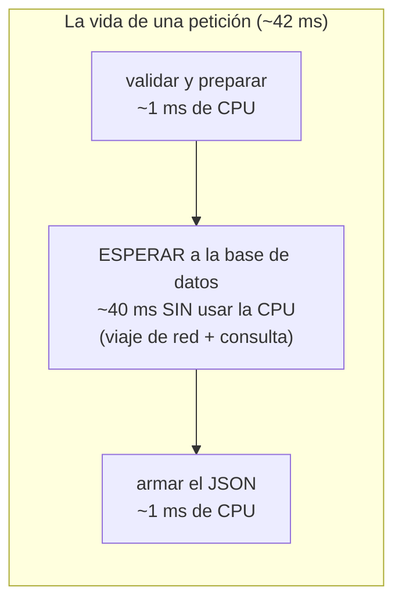
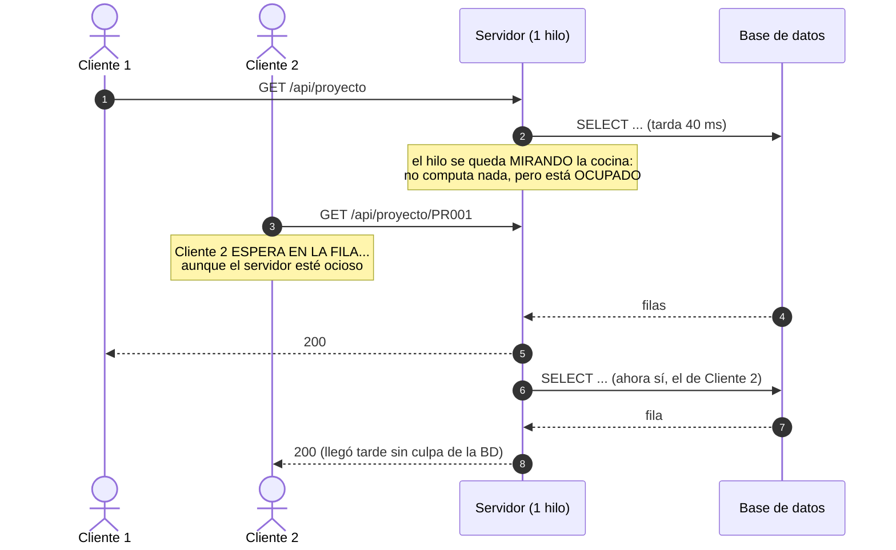
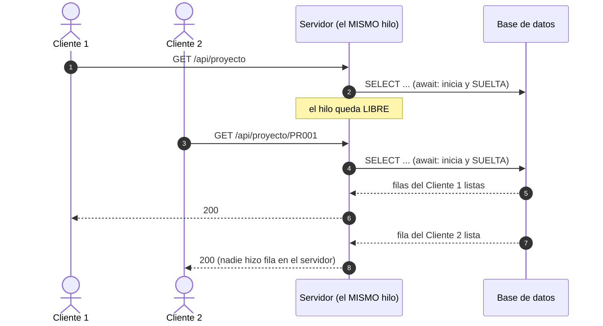

# Programación asincrónica en la web — qué resuelve y qué pasa si no se usa

> Documento conceptual del curso. La pregunta que responde: **¿por qué el
> código de una API web no puede quedarse ESPERANDO, y qué herramientas da
> el lenguaje para no hacerlo?**

---

## 1. El dato que lo explica todo: una petición web casi no COMPUTA — ESPERA

Cuando su API atiende `GET /api/proyecto`, ¿en qué gasta el tiempo?



**El 95% del tiempo, el servidor no está trabajando: está esperando** a la
BD, al disco o a otra API. La pregunta de diseño es: mientras una petición
espera, ¿qué hace el servidor con las demás? Las respuestas posibles son
tres: bloquearse (el problema), liberar el hilo (asincronía) o multiplicar
procesos (el modelo clásico de PHP). Este documento recorre las tres.

## 2. El problema: el mesero que se queda mirando la cocina

Modelo **síncrono bloqueante** con pocos hilos — el hilo que atiende la
petición se queda parado hasta que la BD responda:



**Qué se daña si no se resuelve** (los síntomas reales, en orden de
aparición):

1. **Latencia en fila india:** los usuarios no esperan SU consulta —
   esperan la suma de las de adelante.
2. **Hilos/workers agotados:** con 200 hilos y consultas de 2 segundos,
   el usuario 201 recibe timeout — con la CPU al 5%.
3. **Caídas en cascada:** los clientes reintentan, la fila crece, los
   timeouts se propagan al front... el clásico "se cayó el sistema" que
   en realidad es "se sentó a esperar".
4. **Escalar a punta de plata:** como cada petición secuestra un
   hilo/worker, la salida es comprar más servidores — pagar con
   infraestructura lo que era un problema de diseño.

## 3. La solución asincrónica: soltar el hilo mientras se espera

La idea completa en una frase: **cuando la operación es de
entrada/salida (I/O), el hilo la INICIA, se va a atender a otro, y VUELVE
cuando el resultado está listo.** Eso es `await`:



Las dos esperas de BD ocurren **superpuestas** y el mismo hilo atendió a
ambos clientes. No se volvió más rápida ninguna consulta — se dejó de
desperdiciar la espera. Eso es lo que la asincronía resuelve: **ocupar la
espera, no acelerar el trabajo.**

## 4. Asincronía NO es paralelismo (la confusión clásica)

| | Asincronía (concurrencia por I/O) | Paralelismo (varios núcleos) |
|---|---|---|
| Para qué sirve | Esperas: BD, red, disco | Cómputo pesado: cifrar, comprimir, calcular |
| Cuántos hilos | Pocos (incluso UNO) que no se bloquean | Varios, trabajando a la vez |
| La imagen | UN mesero que atiende 10 mesas mientras la cocina trabaja | 10 cocineros picando a la vez |
| En una API web | La herramienta correcta (la API casi solo espera) | Rara vez el problema de una API CRUD |

## 5. Cómo se ve en ESTE proyecto (código real)

Toda la cadena de la API es asincrónica — fíjese en que `async`/`await` y
`Task<...>` recorren las TRES capas:

```csharp
// Controller: el método del endpoint devuelve Task<IActionResult>
[HttpGet]
public async Task<IActionResult> Listar([FromQuery] int limite = 1000)
    => Ok(await _servicio.ObtenerTodosAsync(limite));

// Servicio: valida y DELEGA — el await pasa de largo
public async Task<List<Proyecto>> ObtenerTodosAsync(int limite)
{
    if (limite <= 0) throw new ArgumentException("El límite debe ser mayor que cero.");
    return await _repositorio.ObtenerTodosAsync(limite);
}

// Repositorio: aquí ocurre la espera REAL (la BD) — y el await libera el hilo
public async Task<List<Proyecto>> ObtenerTodosAsync(int limite)
{
    await using var conexion = CrearConexion();
    var filas = await conexion.QueryAsync<Proyecto>(
        "SELECT ... LIMIT @limite", new { limite });
    return filas.ToList();
}
```

Mientras ese `QueryAsync` espera a la base de datos, el hilo vuelve al
**thread pool** de ASP.NET Core y atiende OTRAS peticiones.

**Los errores clásicos en C# (lo que NO se hace):**

1. **`.Result` o `.Wait()`:** bloquear un Task en vez de esperarlo con
   await desperdicia el hilo — y en ciertos contextos produce **deadlock**
   (el hilo espera al Task y el Task espera al hilo).
2. **`async void`:** un método async que no devuelve Task no se puede
   esperar ni atrapar sus excepciones — solo es válido en manejadores de
   eventos.
3. **Async a medias:** si el repositorio es async pero el servicio lo
   bloquea con `.Result`, toda la cadena vuelve al diagrama 1 — el
   async/await es de punta a punta o no es.

## 6. Referencias

1. MDN — *Asynchronous JavaScript* (los conceptos, aplicables a cualquier
   stack): <https://developer.mozilla.org/es/docs/Learn_web_development/Extensions/Async_JS>
2. Python — `asyncio` (el event loop): <https://docs.python.org/es/3/library/asyncio.html>
   y FastAPI — *Async/await*: <https://fastapi.tiangolo.com/es/async/>
3. Microsoft — *Asynchronous programming with async and await* (C#):
   <https://learn.microsoft.com/dotnet/csharp/asynchronous-programming/>
4. PHP — FPM (el modelo por procesos): <https://www.php.net/manual/es/install.fpm.php>
   y Fibers (PHP 8.1+): <https://www.php.net/manual/es/language.fibers.php>
5. En este repositorio: [FLUJO_DE_UNA_PETICION.md](FLUJO_DE_UNA_PETICION.md)
   (el viaje completo por las capas) y el código de la API, donde este
   documento se ve funcionando.
