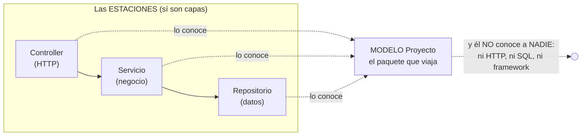

# SOLID, programación por capas y patrones de diseño — en este proyecto

> Documento conceptual del curso: los 5 principios SOLID, la arquitectura
> por capas y los patrones de diseño que este código usa, cada uno con su
> ejemplo REAL en la versión en curso — y en qué versión se termina de
> demostrar.

---

## 1. Programación por capas (la arquitectura del proyecto)

Organizar el sistema en **niveles con responsabilidades distintas**, donde
cada capa solo conoce a la inmediatamente inferior y siempre a través de un
contrato. Así se ve el **viaje de UNA petición** por dentro de la API — el
"diagrama de palitos" del curso:

```
            EL CLIENTE (navegador, Swagger, curl)
                 │
                 │  ① GET /api/proyecto/PR001
                 ▼
┌─────────────────────────────────────────────────────┐
│ CAPA 1 — CONTROLLER (HTTP)                          │
│ Controllers/ProyectoController.cs                   │
│ Recibe la petición (el framework ya validó el body  │
│ contra la petición del verbo) y traduce el          │
│ resultado a códigos HTTP y JSON. NO tiene negocio.  │
│ NO tiene SQL.                                       │
└────────────────┬────────────────────────────────────┘
                 │  ② _servicio.ObtenerPorCodigoAsync("PR001")
                 ▼
┌─────────────────────────────────────────────────────┐
│ CAPA 2 — SERVICIO (negocio)                         │
│ Servicios/ServicioProyecto.cs                       │
│ Las reglas del dominio: qué se puede y qué no (el   │
│ 404 "no existe" NACE aquí). NO conoce ASP.NET.      │
│ NO sabe qué motor hay debajo.                       │
└────────────────┬────────────────────────────────────┘
                 │  ③ _repositorio.ObtenerPorCodigoAsync("PR001")
                 │     — a través de la INTERFAZ IRepositorioProyecto
                 ▼
┌─────────────────────────────────────────────────────┐
│ CAPA 3 — REPOSITORIO (datos)                        │
│ Repositorios/RepositorioProyectoSqlServer.cs        │
│ El SQL a mano (Dapper): traduce filas ↔ objetos     │
│ Proyecto. NO conoce HTTP. NO decide negocio.        │
└────────────────┬────────────────────────────────────┘
                 │  ④ SELECT … FROM proyecto WHERE codigo = @codigo
                 ▼
          ┌───────────────┐
          │ BASE DE DATOS │  SQL Server — mapa_local
          └───────┬───────┘
                  │
   y la respuesta hace el viaje DE VUELTA:
   fila → objeto Proyecto (repositorio) → objeto (servicio)
        → JSON + 200 (controller) → cliente
```

Qué hace — y qué tiene PROHIBIDO — cada capa:

| Capa | Su trabajo | Prohibido para ella | En la v1 |
|---|---|---|---|
| **Controller** | HTTP: rutas, códigos de estado, JSON | SQL y reglas de negocio | `Controllers/ProyectoController.cs` |
| **Servicio** | Las reglas del negocio (¿existe? ¿se puede?) | Saber de HTTP o del motor de BD | `Servicios/ServicioProyecto.cs` |
| **Repositorio** | El SQL y el mapeo fila ↔ objeto | Saber de HTTP o decidir negocio | `Repositorios/RepositorioProyectoSqlServer.cs` |

**La regla:** las dependencias apuntan en una sola dirección y cruzan por
**interfaces**. El controller conoce al servicio; el servicio conoce la
interfaz del repositorio; **nadie** conoce dos capas hacia abajo (el
controller no sabe que existe SQL Server).

**El mismo viaje cuando algo sale mal** — `GET /api/proyecto/PR999`:

1. El **repositorio** no encuentra la fila y devuelve `null` — un HECHO,
   sin opinión.
2. El **servicio** decide qué significa ese hecho: "ese proyecto no
   existe" — y lo dice lanzando `NoEncontradoExcepcion` (una DECISIÓN de
   negocio).
3. El **controller** captura la excepción y la traduce al idioma HTTP:
   **404** con su JSON.

Cada capa aportó exactamente lo suyo: datos → hecho, negocio → decisión,
HTTP → código de estado.

**¿Para qué?** Cada capa se puede cambiar, probar y entender POR SEPARADO.
La prueba viviente en la v1: `pruebas/` corre el servicio real con un
repositorio falso en memoria — sin BD. Eso solo es posible porque las capas
están bien cortadas.

### 1.1 ¿Y los MODELOS? ¿Por qué no aparecen como capa?

Pregunta legítima: la carpeta de modelos (`Modelos/Proyecto.cs`) existe en el
proyecto, pero la tabla de capas no la menciona. ¿Se olvidó? No — **el
modelo NO es una capa, y la diferencia ES la lección:**

- Las **capas son las ESTACIONES del viaje**: cada una le HACE algo a la
  petición (el controller traduce HTTP, el servicio decide, el
  repositorio consulta).
- El **modelo es LO QUE VIAJA entre estaciones**: el repositorio arma un
  `Proyecto` desde la fila, el servicio lo razona, el controller lo
  vuelve JSON. No procesa nada: ES el paquete. Por eso el diagrama de
  palitos no lo pinta como caja — el modelo va implícito en las flechas.



**Guía de lectura:** las tres estaciones lo conocen y él no conoce a
ninguna — a eso se le llama un elemento **transversal**. No viola la regla
de dependencias ("cada capa solo conoce a la de abajo") porque conocer un
modelo no acopla a nada: el modelo no arrastra dependencias, solo trae
datos con tipos.

**¿Entonces para qué se necesita?** Es el **idioma común** del sistema —
el contrato interno entre capas. Sin modelo, las capas se pasarían
diccionarios sueltos sin tipos, y el error de escribir `stok` en vez de
`presupuesto` no lo atraparía nadie hasta producción. Con modelo, lo atrapa el
lenguaje. En C#, además, `Modelos/` (la entidad) convive con `Peticiones/` (los
DTO por verbo): la entidad es el dato como ES; la petición, como LLEGA —
la distinción completa está en [PARADIGMA_POO.md](PARADIGMA_POO.md) §3.

**La regla del modelo** (tan estricta como las de las capas): el modelo
tiene PROHIBIDO importar cosas del proyecto — ni HTTP, ni SQL, ni
conexiones. Sus flechas de dependencia solo ENTRAN; jamás SALEN.

## 2. Los 5 principios SOLID, uno por uno

### S — Responsabilidad única (Single Responsibility)
Cada clase tiene UNA razón para cambiar: el controller si cambia el
protocolo HTTP; el servicio si cambian las reglas de negocio; el
repositorio si cambia el SQL; las peticiones del verbo si cambian las reglas
de forma del body. Ninguna clase hace dos de esas cosas.

```csharp
// ❌ Sin S: un "controller" con tres razones de cambio (HTTP + negocio + SQL)
[HttpGet("{codigo}")]
public async Task<IActionResult> Obtener(string codigo)
{
    await using var conexion = new SqlConnection(...);   // SQL aquí = mezcla
    // ...y el if de "¿existe?" aquí = negocio mezclado
}

// ✅ Con S (la v1): un archivo por razón de cambio
//   Controllers/   → cambia solo si cambia el HTTP
//   Servicios/     → cambia solo si cambian las reglas
//   Repositorios/  → cambia solo si cambia el SQL
//   Peticiones/    → cambia solo si cambian las reglas del body
```

### O — Abierto/Cerrado (Open/Closed)
Abierto a extensión, cerrado a modificación. **El examen llega con el
segundo motor (la v4 del mapa del curso)**: agregar PostgreSQL debe ser
AGREGAR clases (`RepositorioProyectoPostgres : IRepositorioProyecto`) y
tocar SOLO el ensamblador — sin modificar controller, servicio ni la
interfaz.

```csharp
// La v4 AGREGA sin modificar: una clase nueva con la misma interfaz...
public class RepositorioProyectoPostgres : IRepositorioProyecto { /* … */ }

// ...y el ensamblador (Program.cs, ÚNICO archivo tocado) elige el motor
// en UN solo punto — la fábrica de repositorios (ver §3, patrones):
IFabricaRepositorios fabrica = motor switch
{
    "sqlserver" => new FabricaSqlServer(cadenaSqlServer),
    "postgres"  => new FabricaPostgres(cadenaPostgres),
    _ => throw new InvalidOperationException($"Motor desconocido: '{motor}'."),
};
```

### L — Sustitución de Liskov
Cualquier implementación de la interfaz puede ocupar el lugar de otra sin
romper nada. Ya pasa en la v1: `RepositorioFalsoEnMemoria` sustituye a
`RepositorioProyectoSqlServer` en las pruebas y el servicio ni se entera.

```csharp
// El repositorio FALSO de las pruebas (criterio 6): sin BD, misma interfaz
public class RepositorioFalsoEnMemoria : IRepositorioProyecto
{
    private readonly Dictionary<string, Proyecto> _datos = new();

    public Task<Proyecto?> ObtenerPorCodigoAsync(string codigo)
        => Task.FromResult(_datos.GetValueOrDefault(codigo));
    // ...los otros 4 métodos...
}

// y el servicio NI SE ENTERA:
var servicio = new ServicioProyecto(new RepositorioFalsoEnMemoria());
```

### I — Segregación de interfaces
Interfaces pequeñas y específicas: `IRepositorioProyecto` tiene SOLO los 5
métodos de datos de proyecto — no un "IRepositorioDeTodo" que obligue a
implementar métodos que no se usan.

```csharp
// ✅ La interfaz de la v1: SOLO los 5 métodos de datos de proyecto
public interface IRepositorioProyecto
{
    Task<List<Proyecto>> ObtenerTodosAsync(int limite);
    Task<Proyecto?> ObtenerPorCodigoAsync(string codigo);
    Task CrearAsync(Proyecto proyecto);
    Task<int> ActualizarAsync(string codigo, Dictionary<string, object> datos);
    Task<int> EliminarAsync(string codigo);
}

// ❌ El anti-ejemplo: un "IRepositorioDeTodo" de 40 métodos que obliga a
//    implementar lo que no se usa.
```

### D — Inversión de dependencias
Las capas de arriba dependen de ABSTRACCIONES, no de clases concretas:

```csharp
public ServicioProyecto(IRepositorioProyecto repositorio)  // ← interfaz, no clase
```

Solo el **ensamblador** (la sección de DI en `Program.cs`) conoce las
clases concretas. Eso es literalmente "invertir" la dependencia: el detalle
(SQL Server) depende del contrato, no al revés.

## 3. Patrones de diseño (los que trabajan en este proyecto)

**¿Qué es un patrón de diseño?** Una solución **con nombre**, probada y
reutilizable, para un problema de diseño que aparece una y otra vez. No es
código para copiar y pegar: es la FORMA de una solución — qué clases y qué
interfaces participan, y quién conoce a quién — que cada proyecto escribe
en su propio código. El catálogo clásico es el del "Gang of Four" (GoF,
1994): 23 patrones en tres familias — **creacionales** (cómo se construyen
los objetos), **estructurales** (cómo se componen) y **de comportamiento**
(cómo colaboran). Otros, como Repositorio y DTO, vienen del catálogo de
arquitectura empresarial de Fowler (PoEAA, 2002).

La relación con lo anterior: **SOLID dice qué cualidades debe tener el
diseño; los patrones son recetas concretas que las consiguen; las capas
son el plano general donde unos y otras viven.** Y el nombre importa:
decir "esto es una fábrica abstracta" comunica un diseño completo en tres
palabras.

Los que trabajan en este código:

| Patrón | Familia | Dónde vive aquí |
|---|---|---|
| **Repositorio** (Repository) | arquitectónico (PoEAA) | `Repositorios/`: todo el acceso a datos detrás de una interfaz |
| **Inyección de dependencias** | creacional (IoC) | los constructores + el ensamblador de `Program.cs` |
| **DTO** — objeto de petición | arquitectónico (PoEAA) | `Peticiones/`: un objeto por verbo que valida la forma del body |
| **Fábrica abstracta** (Abstract Factory) | creacional (GoF) | llega con el segundo motor (la v4 del curso): la familia completa de repositorios por motor |
| **Estrategia** (Strategy) | comportamiento (GoF) | implícito: implementaciones intercambiables tras cada interfaz |

### Repositorio — el negocio pide datos a un contrato, no a un motor

```csharp
// El contrato (Repositorios/IRepositorioProyecto.cs):
Task<Proyecto?> ObtenerPorCodigoAsync(string codigo);

// ServicioProyecto lo usa SIN saber si detrás hay SQL Server, otro motor
// o un diccionario en memoria (las pruebas). Por eso el segundo motor
// (v4) puede llegar sin tocar una línea del servicio.
```

### Inyección de dependencias — nadie hace `new` de lo que necesita

```csharp
// La dependencia LLEGA por el constructor (una interfaz, no una clase):
public ServicioProyecto(IRepositorioProyecto repositorio) { … }

// y el ÚNICO que sabe qué entregar es el ensamblador (Program.cs):
builder.Services.AddScoped<IServicioProyecto, ServicioProyecto>();
```

### DTO por verbo — el body aterriza en un objeto que solo valida forma

```csharp
public class ProyectoCrear
{
    [Required(ErrorMessage = "El campo codigo es obligatorio.")]
    public string? Codigo { get; set; }
    [Range(0, int.MaxValue, ErrorMessage = "El stock no puede ser negativo.")]
    public int? Stock { get; set; }
    // Si no cumple → 422 con errores[] — y el modelo de dominio ni se entera.
}
```

### Fábrica abstracta — UNA decisión, la familia completa (v4)

```csharp
// Así la construye la v4 del curso: un punto del código decide el motor…
IFabricaRepositorios fabrica = motor switch
{
    "sqlserver" => new FabricaSqlServer(cadenaSqlServer),
    "postgres"  => new FabricaPostgres(cadenaPostgres),
    _ => throw new InvalidOperationException($"Motor desconocido: '{motor}'."),
};
// …y la fábrica entrega los repositorios COHERENTES entre sí:
builder.Services.AddScoped<IRepositorioProyecto>(_ => fabrica.CrearRepositorioProyecto());
// Agregar un motor cuesta UNA clase y UN case — eso compra el patrón.
```

### Estrategia — el patrón que va de regalo

La pareja "interfaz + implementaciones intercambiables"
(`RepositorioProyectoSqlServer`, el falso de las pruebas — y los
repositorios de cada motor que vengan) es la esencia de Strategy. La
elección no cambia en caliente: se hace UNA vez al arrancar — pero el
mecanismo es el mismo: quien usa la interfaz jamás pregunta cuál
implementación le tocó.

## 4. El mapa SOLID ↔ versiones del curso

| Principio | Se ve desde | Se termina de demostrar en |
|---|---|---|
| S | v1 (una clase por responsabilidad) | v2 (más entidades, mismas responsabilidades) |
| O | v1 (la interfaz existe) | **v4** (segundo motor sin tocar lo construido) |
| L | v1 (el repositorio falso de las pruebas) | v4 (motores intercambiables de verdad) |
| I | v1 (interfaces mínimas) | v3 (los puentes: contratos sin verbos que no aplican) |
| D | v1 (constructores reciben interfaces) | v4 (la fábrica reemplaza al ensamblador simple) |

## 5. Referencias

1. Martin, R. — *Design Principles and Design Patterns* (el texto original
   de SOLID).
2. Gamma, Helm, Johnson y Vlissides — *Design Patterns* (GoF, 1994): el
   catálogo original de los 23 patrones.
3. Fowler, M. — *Patterns of Enterprise Application Architecture* (PoEAA,
   2002): Repositorio, DTO y compañía.
4. Microsoft — Inyección de dependencias en .NET:
   <https://learn.microsoft.com/dotnet/core/extensions/dependency-injection>
3. En este repositorio: [PARADIGMA_POO.md](PARADIGMA_POO.md) (los pilares
   sobre los que SOLID se apoya) y el spec kit de la versión en curso.
