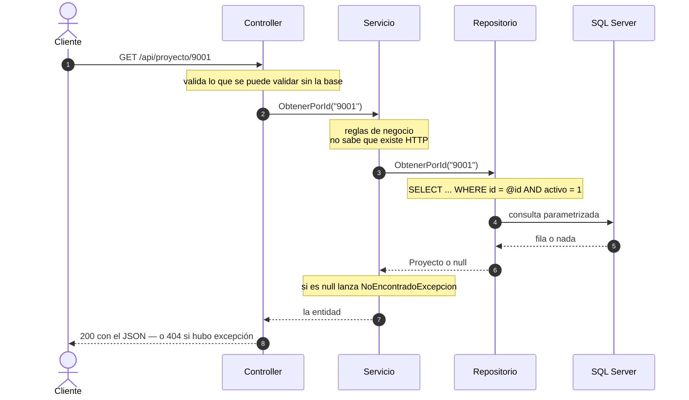
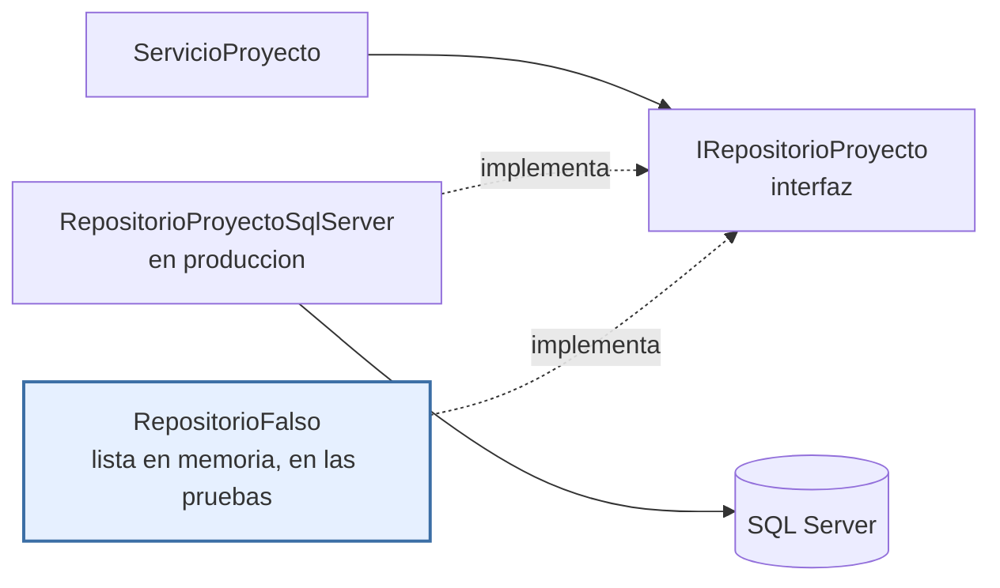
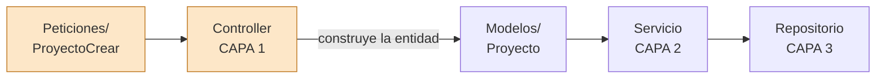
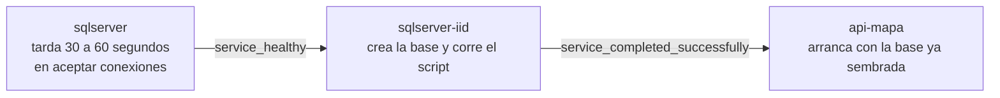

# Plan técnico — Versión 1: `proyecto` (C# / ASP.NET Core)

> El CÓMO de la [especificación](2_spec.md). Si algo de aquí contradice la
> [constitución](../../1_constitution.md), manda la constitución.

## 1. Stack

| Pieza | Elección | Por qué |
|---|---|---|
| Lenguaje y framework | **C# / ASP.NET Core (.NET 10)** | Artículo 2 |
| Acceso a datos | **Dapper** sobre ADO.NET, con SQL escrito a mano y parametrizado | Artículo 2 · [D1](4_research.md) |
| Motor | **SQL Server 2022** en contenedor | El script del módulo es T-SQL |
| Documentación | **Swashbuckle** (Swagger) en `/swagger` | RNF de la spec |
| Orquestación | **Docker Compose**, tres servicios | Artículo 4 |

Paquetes permitidos y ninguno más: `Microsoft.Data.SqlClient`, `Dapper` y
`Swashbuckle.AspNetCore`.

## 2. Estructura de carpetas

Los archivos de la v1, todos dentro de `api_mapa/`:

```
api_mapa/
├── ApiMapa.csproj          los tres paquetes, y nada más
├── Dockerfile                       imagen SDK + dotnet watch
├── appsettings.json                 cadena de desarrollo (el compose la sobreescribe)
├── Program.cs                       el ENSAMBLADOR: el único que conoce clases concretas
├── Modelos/
│   └── Proyecto.cs          la entidad: lo que viaja entre capas
├── Peticiones/                      la frontera de entrada — aquí nacen los 422
│   ├── ProyectoCrear.cs         los 4 campos, todos obligatorios
│   ├── ProyectoReemplazo.cs     los 3 campos del PUT, obligatorios
│   └── ProyectoActualizar.cs    los 3 del PATCH, todos opcionales
├── Servicios/                       CAPA 2 — negocio
│   ├── IServicioProyecto.cs     lo único que el controlador conoce
│   └── ServicioProyecto.cs
├── Repositorios/                    CAPA 3 — datos
│   ├── IRepositorioProyecto.cs  lo único que el servicio conoce
│   └── RepositorioProyectoSqlServer.cs   el SQL, parametrizado
├── Excepciones/
│   └── NoEncontradoExcepcion.cs     cómo el negocio dice "404" sin hablar de HTTP
├── Controllers/                     CAPA 1 — HTTP
│   └── ProyectoController.cs    los 7 endpoints
└── pruebas/
    ├── PruebaCapas.csproj
    └── Proyecto.cs                  prueba el servicio con un repositorio de mentiras,
                                     que guarda las filas en memoria (§4.6)
```

**Ninguna carpeta nueva.** Si al construir aparece la necesidad de una, es
señal de que el plan está incompleto: se corrige aquí, no en el código.

> **`pruebas/` está adentro pero NO es parte de la API.** El SDK Web
> compila todos los `.cs` que encuentre bajo su carpeta, así que sin decirle
> lo contrario el repositorio de mentiras terminaría **publicado dentro del
> sistema real**. El `.csproj` de la API lo excluye:
>
> ```xml
> <ItemGroup>
>   <Compile Remove="pruebas/**" />
>   <Content Remove="pruebas/**" />
>   <None Remove="pruebas/**" />
> </ItemGroup>
> ```
>
> El síntoma cuando falta: `warning CS0436` — "el tipo X está en conflicto
> con el tipo importado X". Es una advertencia, no un error, así que pasa
> desapercibida.

## 3. Arquitectura en capas: el viaje de una petición



La regla: **el controlador no toca SQL, el servicio no conoce HTTP ni el
motor, el repositorio no conoce HTTP.**

## 4. Decisiones de diseño aterrizadas

### 4.1 Una petición por verbo, y ahí nacen los 422

`Crear` exige los cuatro campos; `Reemplazo` exige los tres del cuerpo;
`Actualizar` los tiene **todos opcionales**. No es repetición inútil: es
lo que hace que el **mismo cuerpo** dé 422 en `PUT` y 200 en `PATCH` sin
un solo `if` en el servicio. La validación vive en el borde, con
anotaciones, y el negocio recibe datos ya sanos.

### 4.2 El borrado lógico vive en el repositorio

`Eliminar` ejecuta `UPDATE … SET activo = 0 WHERE id = @id AND activo = 1`
y devuelve las filas afectadas. **Cero filas ⇒ no existe o ya estaba
inactiva ⇒ 404**, que es exactamente lo que piden C4 y C5 de la spec, sin
una consulta previa.

Y **todo listado lleva `WHERE activo = 1`**. Si alguna consulta lo olvida,
los inactivos reaparecen: es el error más probable de esta versión.

### 4.3 El ensamblador es la sección de DI de `Program.cs`

```csharp
builder.Services.AddScoped<IRepositorioProyecto,
                           RepositorioProyectoSqlServer>();
builder.Services.AddScoped<IServicioProyecto, ServicioProyecto>();
```

Esas dos líneas son **el único lugar** donde una clase concreta aparece
junto a su interfaz. Cambiar de motor en la v2 será cambiar una línea aquí.

### 4.4 Las excepciones se traducen a HTTP en el controlador

`NoEncontradoExcepcion` → 404 · `ArgumentException` → 400 ·
`SqlException` y demás → 500. El servicio lanza; el controlador traduce.
Así el negocio no menciona códigos HTTP.

### 4.5 El `id` no se cambia nunca

Identifica la fila. Va en la ruta, no en el cuerpo de `PUT` ni de `PATCH`
(§4 del [modelo de datos](5_data_model.md)).

### 4.6 El repositorio de mentiras: qué es y para qué sirve

El criterio 7 de la spec exige probar el servicio **sin SQL Server
encendido**. Eso se puede porque el servicio **no conoce el repositorio
real**: solo conoce la interfaz `IRepositorioProyecto`.

Entonces, para las pruebas, se escribe una **segunda implementación de esa
misma interfaz** que en vez de hablar con la base guarda las filas en una
lista en memoria:

```csharp
// pruebas/Proyecto.cs — un repositorio de mentiras
public class RepositorioFalso : IRepositorioProyecto
{
    private readonly List<Proyecto> _filas = new();   // la "base de datos"

    public Task<Proyecto?> ObtenerPorId(string id) =>
        Task.FromResult(_filas.FirstOrDefault(a => a.Id == id));
    // …y así con los demás métodos
}
```

Al servicio se le entrega ese en lugar del de SQL Server, y **no se entera
de la diferencia**: pide lo mismo, por la misma interfaz.



**Para qué sirve, en concreto:**

- La prueba corre **en segundos y en cualquier máquina**, sin levantar
  contenedores ni esperar a que el motor arranque.
- Prueba **las reglas de negocio**, no la base: que pedir un código que no
  existe lance `NoEncontradoExcepcion`, que actualizar devuelva las filas
  afectadas correctas.
- Y sobre todo: **es la demostración de que las capas están desacopladas
  de verdad.** Si esa prueba exige SQL Server para pasar, es que el
  servicio se enteró del motor por algún lado — y el Artículo 3 está roto.

Por eso el criterio 7 no es un adorno: es el único que verifica la
arquitectura en vez de verificar la funcionalidad.

### 4.7 Quién traduce la petición en entidad

Las clases de `Peticiones/` **no cruzan a la capa 2**. El servicio y el
repositorio solo conocen `Modelos/`.



**El controlador es el traductor.** Recibe la petición ya validada por el
framework, y de ahí arma lo que la capa 2 entiende: una entidad para
`Crear` y `Reemplazar`, o los tres campos sueltos para `ActualizarParcial`.

**Por qué importa.** Una petición describe **el cuerpo de una llamada
HTTP**: qué campos son obligatorios en un `POST`, cuáles opcionales en un
`PATCH`. Eso es forma del protocolo, no del negocio. Si el servicio
recibiera `ProyectoCrear`, cambiar la forma del cuerpo obligaría a
tocar la capa 2 — que no debería enterarse de que existe HTTP (Artículo 3).

La señal para detectarlo es de una línea: **si en `Servicios/` o en
`Repositorios/` aparece un `using` de `Peticiones`, la capa está rota.**

### 4.8 SQL compuesto no es SQL concatenado

El `PATCH` escribe **solo los campos que llegaron**, así que su `UPDATE` no
se puede escribir de antemano: hay ocho combinaciones posibles. Se compone:

```csharp
var sql = $"UPDATE proyecto SET {string.Join(", ", asignaciones)} WHERE id = @Id AND activo = 1";
```

**Eso parece violar el Artículo 2, y no lo viola.** La diferencia está en
QUÉ se compone:

| | Ejemplo | ¿Es seguro? |
|---|---|---|
| **Nombres de columna** de una lista cerrada que escribimos nosotros | `"gran_area = @GranArea"` | **Sí.** Ninguna de esas cadenas viene de afuera: están escritas en el código, una por campo |
| **Valores** que llegan del cliente | `$"... WHERE id = '{id}'"` | **Nunca.** Eso es inyección esperando turno |

La regla, en una línea: **la forma de la consulta puede componerse; los
datos, jamás.** Los valores viajan siempre como `@parametro`, incluso en el
SQL compuesto — por eso ahí se usan `DynamicParameters`.

**Cómo revisarlo en un Pull Request:** busque una interpolación o un `+`
dentro de una cadena SQL y pregunte de dónde sale lo que se pega. Si sale
de una lista escrita en el código, está bien. Si sale de un argumento del
método, está mal.

### 4.9 El 422 no sale solo: hay que configurarlo

El contrato exige que un cuerpo inválido responda **422** con el sobre
`{estado, mensaje, errores[]}`. **ASP.NET no hace eso por defecto.**

Con `[ApiController]`, cuando una anotación falla el framework corta la
petición **antes de entrar al método** y responde un **400** con
`ValidationProblemDetails`, que es otro formato. O sea: las anotaciones
funcionan, pero la respuesta no cumple el contrato — y no hay un `catch`
donde arreglarlo, porque el código del controlador nunca se ejecuta.

Se corrige en `Program.cs`, reemplazando la fábrica de respuestas:

```csharp
builder.Services.Configure<ApiBehaviorOptions>(opciones =>
{
    opciones.InvalidModelStateResponseFactory = contexto =>
    {
        var errores = contexto.ModelState
            .Where(e => e.Value?.Errors.Count > 0)
            .SelectMany(e => e.Value!.Errors.Select(x => x.ErrorMessage))
            .ToList();

        return new ObjectResult(new
        {
            estado = 422,
            mensaje = "Datos inválidos.",
            errores
        })
        { StatusCode = 422 };
    };
});
```

**Por qué importa tanto:** de los siete criterios de aceptación, el 4 y el
6 dependen del 422 — el contraste `PUT` 422 vs `PATCH` 200, y la
validación como frontera. Sin estas líneas, ambos fallan, y el síntoma es
confuso: la validación *sí* funciona, pero responde 400 con otro cuerpo.

## 5. Docker: un solo comando

Tres servicios: `sqlserver`, `sqlserver-iid` (crea la base y corre el
script una vez, porque SQL Server no ejecuta lo que se le monte) y
`api-mapa` (código montado, `dotnet watch`).

### 5.1 El orden de arranque, que es lo que más se rompe

Los tres servicios **no arrancan a la vez**: hay un orden, y respetarlo es
la diferencia entre que funcione y que no.



**Esperar a que el contenedor exista NO sirve.** El contenedor de SQL
Server existe en un segundo; el motor tarda entre 30 y 60 en aceptar
conexiones. Si el inicializador arranca antes, `sqlcmd` falla, el
contenedor muere, y la API queda hablándole a una base vacía. Es el error
más común de este compose.

Por eso el `sqlserver` lleva un **healthcheck** que le pregunta al motor si
ya responde consultas, y los otros dos esperan **condiciones**, no la
simple existencia:

```yaml
  sqlserver:
    healthcheck:
      test: ["CMD-SHELL", "/opt/mssql-tools18/bin/sqlcmd -S localhost -U sa -P \"$$MSSQL_SA_PASSWORD\" -C -Q 'SELECT 1' -b"]
      interval: 10s
      timeout: 10s
      retries: 20
      start_period: 30s        # margen de gracia: el motor tarda en arrancar

  sqlserver-iid:
    depends_on:
      sqlserver:
        condition: service_healthy               # espera a que RESPONDA

  api-mapa:
    depends_on:
      sqlserver-iid:
        condition: service_completed_successfully # espera a que TERMINE BIEN
```

### 5.2 Lo que hay que fijar, y por qué

| Cosa | Valor | Por qué así |
|---|---|---|
| Puertos de `sqlserver` | `"11473:1433"` | 1433 es el puerto del motor adentro; 11473 el del host (Artículo 10) |
| Puertos de la API | `"8076:8076"` | La API escucha en **8076 también adentro**, no en 8080: así el `Dockerfile`, el `appsettings.json` y los contratos dicen el mismo número |
| Volumen de datos | `mssqldata:/var/opt/mssql` | El directorio **completo**, no solo `/data`: ahí viven también los registros y los secretos del motor |
| Volúmenes de la API | `./api_mapa:/app` más `/app/bin` y `/app/obj` anónimos | El código montado es lo que permite `dotnet watch`. Los dos anónimos dejan los compilados **dentro** del contenedor: sin ellos se mezclan los binarios de Linux con los de Windows y la compilación falla con errores incomprensibles |
| Nombre de la cadena | `ConnectionStrings__SqlServer` | El doble guion bajo hace que ASP.NET la lea como `ConnectionStrings:SqlServer` y **sobreescriba** el `appsettings.json`. El nombre tiene que ser exactamente ese en los dos lados |
| Contraseña de `sa` | `Aplicacionweb123!` | Escrita en el compose: es la excepción declarada del Artículo 7, porque esta plantilla corre en contenedores desechables. **En un proyecto real va en el `.env`** |
| Script montado | `./db:/scripts:ro` en `sqlserver-iid` | De solo lectura: el inicializador lo ejecuta, no lo modifica |

**Lo que NO se pone:** `version:` al comienzo del archivo. Compose v2 lo
ignora y advierte que está obsoleto.

## 6. Chequeo de constitución

> **La compuerta 2** del método: antes de pasar a las tareas se revisa la
> [constitución](../../1_constitution.md) artículo por artículo. Si algo no
> cumple, o se corrige el plan, o se enmienda la constitución.

| Artículo | Cómo lo cumple la v1 |
|---|---|
| **1** — Por versiones, la spec manda | Solo `proyecto`. Sin FK, sin JWT, sin front. Cierra con tag `v1` |
| **2** — C#/ASP.NET Core, SQL a la vista | Dapper, SQL a mano y siempre `@parametro`. Los tres paquetes del §1 y ninguno más |
| **3** — Tres capas con interfaces | §3 y §4.3: solo `Program.cs` conoce clases concretas |
| **4** — Un solo comando | §5 |
| **5** — La base viene dada | Las 21 tablas se crean desde `db/`; la v1 solo nombra una ([modelo](5_data_model.md) §1) |
| **6** — Borrado lógico | §4.2: `UPDATE activo = 0` y `WHERE activo = 1` en todo listado |
| **7** — Secretos | La contraseña vive en el `docker-compose.yml`, no en el código ni en este documento. Excepción declarada de la plantilla |
| **8** — Español y decisiones sustentadas | Nombres y mensajes en español; los comentarios explican por qué, no qué hace cada palabra |
| **9** — Contratos exactos | [6_contracts.md](6_contracts.md) fija los 7 endpoints con todos sus códigos, incluido `PUT` 422 vs `PATCH` 200 |
| **10** — Convenciones | Puertos 8076/11473, rutas `/`, `/swagger`, `/api/proyecto`, el sobre `{tabla, limite, total, datos}` y el catálogo de errores |
| **11** — Enmiendas | Ninguna necesaria: esta versión no pide cambiar ninguna regla |

**Complejidad justificada:** ninguna. La v1 no se desvía de ningún
artículo, así que no hay excepciones que sustentar.
