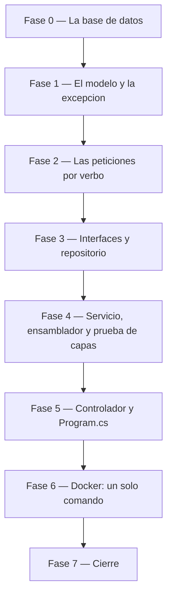

# Tareas — Versión 1: `proyecto`

> El orden de construcción, en fases. Cada fase termina en una
> **compuerta**: un comando concreto que se corre y se mira. No se avanza
> con una fase en rojo.
>
> `[P]` marca las tareas que **no dependen entre sí** y pueden repartirse.
> En una construcción por capas la mayoría son secuenciales, y está bien.

## Fase 0 — La base de datos en pie

**Lo que YA viene dado** (es artefacto, se usa tal cual — Artículo 5):

- `db/mapa_conocimiento.sql` — el DDL con sus correcciones, la columna `activo`
  y las semillas
- `db/iid.sh` — el inicializador

**Lo que hay que ESCRIBIR en esta fase:**

- [ ] `docker-compose.yml` con los servicios `sqlserver` y
      `sqlserver-iid`, montando `./db` como `/scripts`

**Verificar:** `docker compose up -d --build`, y después
este conteo — **nombrando las tablas**, que si no, no se sabe cuál es cuál:

| Tabla | Filas esperadas |
|---|---|
| `area_conocimiento` | **218** |
| `universidad` | **6** |
| **`proyecto`** | **0** — la tabla de la v1 arranca vacía, a propósito (C7) |

(`facultad` y `proyecto` también quedan **vacías**: el Excel no trae sus
columnas obligatorias — C6.)

## Fase 1 — El proyecto que arranca y responde · *RF7*

- [ ] `ApiMapa.csproj` con los tres paquetes permitidos
- [ ] `[P]` `appsettings.json` — la cadena de conexión de desarrollo, para
      poder correr sin Docker. **El compose la sobreescribe**
      ([3_plan](3_plan.md) §5)
- [ ] `Program.cs` **mínimo**: Swagger y el endpoint de diagnóstico `GET /`
      del RF7. Todavía sin ensamblador ni controladores — eso llega en la
      Fase 5, cuando existan las clases que registrar
- [ ] `Modelos/Proyecto.cs` — la entidad: `Id`, `GranArea`, `Area`,
      `Disciplina`. **Sin `Activo`**: no viaja en las respuestas
- [ ] `[P]` `Excepciones/NoEncontradoExcepcion.cs`

**Verificar:** `dotnet run --project api_mapa` arranca, y
`curl http://localhost:8076/` responde el diagnóstico con `"version":"v1"`.

> **Por qué el `Program.cs` va aquí y no al final.** Con el SDK Web y sin
> punto de entrada, el proyecto **no compila**: `error CS5001`. Si se deja
> para la última fase, ninguna compuerta anterior se puede pasar y se
> avanza a ciegas hasta el final. Empezar por algo que arranca —aunque solo
> responda una ruta— es lo que permite verificar cada fase.

## Fase 2 — Las peticiones por verbo · *RF3, RF4, RF5*

- [ ] `[P]` `Peticiones/ProyectoCrear.cs` — los 4 campos, todos
      `[Required]`; `Id` con `[MaxLength(6)]`
- [ ] `[P]` `Peticiones/ProyectoReemplazo.cs` — los 3 del cuerpo,
      obligatorios
- [ ] `[P]` `Peticiones/ProyectoActualizar.cs` — los 3, todos
      opcionales

Las tres son independientes: se pueden repartir.

**Verificar:** `dotnet build api_mapa` compila. La diferencia
entre la segunda y la tercera es lo que producirá el 422 del `PUT` y el 200
del `PATCH`.

## Fase 3 — Interfaces y repositorio · *RF1, RF2, RF6*

- [ ] `Repositorios/IRepositorioProyecto.cs` — los siete métodos
- [ ] `Servicios/IServicioProyecto.cs`
- [ ] `Repositorios/RepositorioProyectoSqlServer.cs` — el SQL con
      Dapper, **siempre parametrizado**, con `WHERE activo = 1` en todo
      listado y el `UPDATE … SET activo = 0` del borrado

**Verificar:** `dotnet build api_mapa` compila, y una lectura del
código confirma que **ninguna** consulta concatena valores y que **ningún**
listado olvida el `activo = 1`.

## Fase 4 — Servicio, ensamblador y prueba de capas · *criterio 7*

- [ ] `Servicios/ServicioProyecto.cs` — reglas de negocio; lanza
      `NoEncontradoExcepcion` cuando el repositorio no devuelve nada
- [ ] `pruebas/PruebaCapas.csproj` y `pruebas/Proyecto.cs` — un
      **repositorio de mentiras** (otra implementación de
      `IRepositorioProyecto`, con una lista en memoria) y las
      verificaciones del servicio contra él ([3_plan](3_plan.md) §4.6)

**Verificar:** `dotnet run --project api_mapa/pruebas` pasa
**sin SQL Server encendido**. Si exige la base, las capas no están
desacopladas.

## Fase 5 — Controlador y ensamblado · *todos los RF*

- [ ] `Controllers/ProyectoController.cs` — los 7 endpoints, con
      la traducción de excepciones a códigos HTTP
- [ ] `Program.cs` **crece**: se le agregan las dos líneas del ensamblador
      ([3_plan](3_plan.md) §4.3) y el registro de controladores. Lo que ya
      tenía —Swagger y el diagnóstico— no se toca

**Verificar:** `dotnet run` y los siete endpoints responden contra la base
que ya está en pie: `curl -i http://localhost:8076/api/proyecto` devuelve
**204** —la tabla está vacía— y después de un `POST`, **200 con total 1**.

## Fase 6 — Docker: un solo comando · *criterio 1*

- [ ] `api_mapa/Dockerfile` — imagen SDK con `dotnet watch`
- [ ] `docker-compose.yml` — el servicio `api-mapa`, con la cadena
      de conexión por variable de entorno

**Verificar:** `docker compose down -v` y luego
`docker compose up -d --build` deja **todo** funcionando desde cero.

## Fase 7 — Cierre

- [ ] Correr el smoke test completo de [7_quickstart.md](7_quickstart.md)
- [ ] Pasar y **firmar** [9_checklist.md](9_checklist.md)
- [ ] `postman/coleccion_v1.postman_collection.json` y el `README.md`
- [ ] Commit y **tag `v1`**

**Verificar:** los 7 criterios de aceptación en verde, con la salida real
pegada. Sin eso no hay tag.

## El FRONT: la otra mitad de la versión

Va **después** de que la API responda y **antes** del cierre. Sin esta fase la
versión está a medias.

| # | Tarea | Archivo |
|---|---|---|
| 1 | El proyecto Blazor Server, **sin ningún paquete de acceso a datos** | `front_blazor/FrontMapa.csproj` |
| 2 | `ServicioProyecto`: seis métodos, uno por operación | `Servicios/ServicioProyecto.cs` |
| 3 | El tipo `Resultado<T>`, para que las páginas no vean códigos de estado | `Servicios/ServicioProyecto.cs` |
| 4 | La traducción del sobre de error a textos para el usuario | `Servicios/ServicioProyecto.cs` |
| 5 | El marco y el menú, con **un enlace por pantalla** | `Components/Layout/` |
| 6 | La pantalla del CRUD, con los **dos botones** de guardar | `Components/Pages/Proyectos.razor` |
| 7 | Los estilos, escritos a mano | `wwwroot/app.css` |
| 8 | El servicio en el compose, en el **8077**, sin `depends_on: sqlserver` | `docker-compose.yml` |
| 9 | La prueba de humo del front | `pruebas_humo/humo_front.py` |

**Verificación de la fase:**

- [ ] `http://localhost:8077/proyectos` muestra las filas.
- [ ] El recorrido a mano de `7_quickstart.md` se hizo completo.
- [ ] `python pruebas_humo/humo_front.py` da todo en verde.
- [ ] **Con `docker compose stop api-mapa`, la pantalla sigue en pie
      con su aviso y sin un solo dato.**
